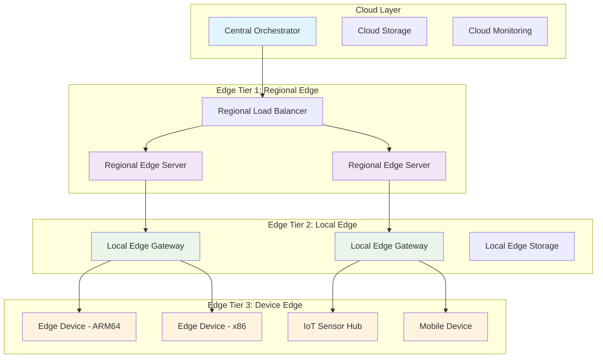
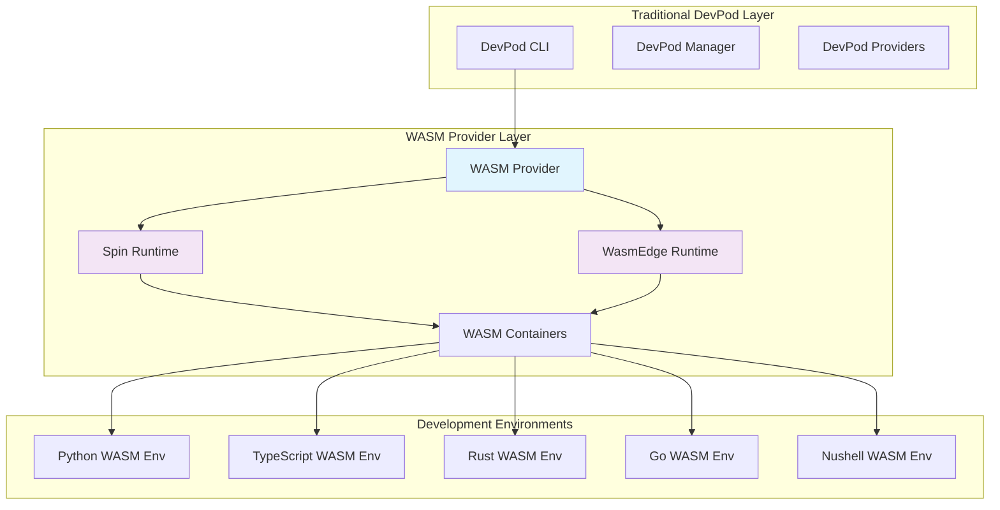
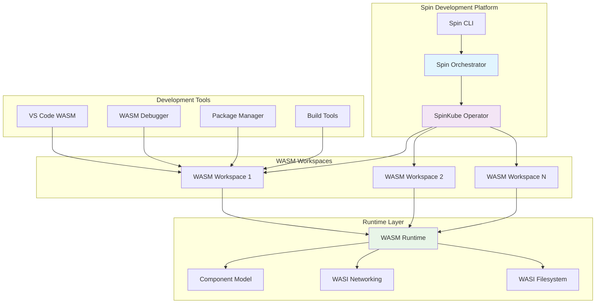

# Swarm Flow Ecosystem: Comprehensive Platform-Agnostic Refactoring Plan

## Executive Summary

This document outlines a comprehensive refactoring plan to transform the current `claude-flow` ecosystem into a **next-generation, platform-agnostic AI agent orchestration platform** called **Swarm Flow**. Building upon the existing production-ready infrastructure including completed coordination systems, web UI, and DevPod management, this plan integrates WASM-first architecture, advanced AI capabilities, and enterprise-grade features to create an infinitely scalable system.

## Vision: Intelligent AI Agent Ecosystem

### Evolution Strategy
```
Current Production Systems → Enhanced Integration → WASM Components → Global Scale
         ↓                        ↓                    ↓                ↓
✅ Coordination System    → AI-Powered Orchestration → Portable Modules → Infinite Scale
✅ Web UI Backend        → Enhanced User Experience  → WASM UI Components → Edge Computing
✅ DevPod Management     → Intelligent Automation    → Container-Native   → Hybrid Cloud
✅ MCP Tools (64+)       → Extended Capabilities     → WASM Bridge        → Universal Access
```

### Core Principles
1. **Build on Existing**: Leverage completed production-ready systems
2. **AI-Enhanced**: Integrate advanced AI capabilities throughout the platform
3. **WASM-Native**: Gradual migration to WebAssembly for universal portability
4. **Platform-Agnostic**: Run anywhere - DevPod, Docker, Kubernetes, Edge devices
5. **Enterprise-Ready**: Production-grade security, monitoring, and scalability

## Current State Analysis

### ✅ Completed Production Systems
```
polyglot-devenv/
├── claude-flow/                    # ✅ COMPLETE: v1.0.71 with coordination system
│   ├── src/coordination/           # ✅ Full coordination implementation
│   ├── src/ui/console/            # ✅ Web UI backend infrastructure
│   └── benchmark/                 # ✅ Performance benchmarking system
├── mcp/                           # ✅ COMPLETE: 64+ tools across 12 categories
│   ├── polyglot-server.ts         # ✅ Production MCP server
│   └── tests/functional-test-suite/ # ✅ Comprehensive testing
├── dojo/                          # ✅ AG-UI application with CopilotKit
├── dev-env/                       # ✅ 5 polyglot environments
│   ├── python/                    # ✅ Python development environment
│   ├── typescript/                # ✅ TypeScript development environment
│   ├── rust/                      # ✅ Rust development environment
│   ├── go/                        # ✅ Go development environment
│   └── nushell/                   # ✅ Nushell automation environment
├── host-tooling/                  # ✅ DevPod management infrastructure
│   └── devpod-management/         # ✅ Centralized DevPod orchestration
├── .claude/hooks/                 # ✅ Enhanced AI hooks (4 production hooks)
└── context-engineering/           # ✅ PRP framework implementation
```

### 🚀 Key Achievements
1. **Coordination System**: Complete fault-tolerant coordination with deadlock detection
2. **Web UI Backend**: Console-style interface with WebSocket real-time communication
3. **MCP Integration**: 64+ tools with comprehensive testing and validation
4. **DevPod Management**: Centralized container orchestration with `manage-devpod.nu`
5. **Enhanced AI Hooks**: 4 production-ready hooks for automated workflows
6. **Performance Analytics**: Comprehensive monitoring and optimization systems
7. **Agentic Environments**: 5 AG-UI protocol environments with agent lifecycle management

### 🎯 Strategic Opportunities
1. **WASM Integration**: Gradual migration to WebAssembly for universal portability
2. **AI Enhancement**: Advanced AI-powered optimization and automation
3. **Enterprise Features**: Security, compliance, and enterprise-grade capabilities
4. **Edge Computing**: Extend to edge devices and hybrid cloud deployments
5. **Developer Experience**: Enhanced tooling and developer productivity features

## Proposed Integrated Architecture

### Enhanced Monorepo Structure
```
polyglot-devenv/
├── packages/                           # 🆕 Enhanced Core Packages
│   ├── coordination-enhanced/          # 🔄 Enhanced coordination system
│   │   ├── swarm-coordinator/          # ✅ Existing + WASM integration
│   │   ├── task-scheduler/             # ✅ Existing + AI optimization
│   │   ├── resource-manager/           # ✅ Existing + intelligent allocation
│   │   └── conflict-resolution/        # ✅ Existing + ML-based resolution
│   ├── web-ui-enhanced/                # 🔄 Enhanced web interface
│   │   ├── console-backend/            # ✅ Existing WebSocket infrastructure
│   │   ├── dashboard-components/       # 🆕 Advanced monitoring dashboards
│   │   ├── agent-visualization/        # 🆕 Real-time agent visualization
│   │   └── performance-analytics/      # 🆕 Performance monitoring UI
│   ├── mcp-enhanced/                   # 🔄 Enhanced MCP integration
│   │   ├── polyglot-server/            # ✅ Existing 64+ tools
│   │   ├── wasm-bridge/                # 🆕 WASM MCP bridge
│   │   ├── ai-tools/                   # 🆕 AI-powered MCP tools
│   │   └── security-layer/             # 🆕 Enhanced security features
│   ├── devpod-enhanced/                # 🔄 Enhanced DevPod management
│   │   ├── management-core/            # ✅ Existing manage-devpod.nu
│   │   ├── resource-optimizer/         # 🆕 Intelligent resource management
│   │   ├── performance-analyzer/       # 🆕 Performance analytics
│   │   ├── security-manager/           # 🆕 Security and compliance
│   │   ├── cost-optimizer/             # 🆕 Cost tracking and optimization
│   │   ├── backup-manager/             # 🆕 Backup and disaster recovery
│   │   ├── auto-scaler/                # 🆕 Auto-scaling and load management
│   │   └── collaboration-manager/      # 🆕 Team collaboration features
│   ├── ai-enhanced/                    # 🆕 Advanced AI capabilities
│   │   ├── enhanced-hooks/             # ✅ Existing 4 production hooks
│   │   ├── context-engineering/        # ✅ Existing PRP framework
│   │   ├── intelligent-orchestration/  # 🆕 AI-powered orchestration
│   │   ├── predictive-scaling/         # 🆕 ML-based scaling decisions
│   │   └── automated-optimization/     # 🆕 Continuous optimization
│   ├── wasm-integration/               # 🆕 WASM migration layer
│   │   ├── wasm-sdk/                   # 🆕 Universal WASM SDK
│   │   ├── spin-orchestrator/          # 🆕 Spin-native orchestration
│   │   ├── wasm-agents/                # 🆕 Language-specific WASM agents
│   │   ├── wasm-memory/                # 🆕 Cross-platform memory management
│   │   └── edge-runtime/               # 🆕 Edge computing capabilities
│   └── enterprise-features/            # 🆕 Enterprise-grade capabilities
│       ├── security-compliance/        # 🆕 SOC2, PCI-DSS compliance
│       ├── audit-logging/              # 🆕 Comprehensive audit trails
│       ├── rbac-system/                # 🆕 Role-based access control
│       ├── multi-tenancy/              # 🆕 Multi-tenant architecture
│       └── disaster-recovery/          # 🆕 Enterprise disaster recovery
├── apps/                               # 🔄 Enhanced Applications
│   ├── claude-flow-enhanced/           # 🔄 Enhanced CLI with new features
│   ├── web-console/                    # ✅ Existing + enhanced features
│   ├── dojo-enhanced/                  # 🔄 Enhanced AG-UI with WASM
│   ├── monitoring-dashboard/           # 🆕 Comprehensive monitoring
│   └── admin-portal/                   # 🆕 Enterprise administration
├── infrastructure/                     # 🔄 Enhanced Infrastructure
│   ├── kubernetes/                     # 🔄 Enhanced K8s manifests
│   │   ├── spin-kube/                  # 🆕 spin-kube operator configs
│   │   ├── wasmedge-runtime/           # 🆕 WasmEdge runtime configs
│   │   ├── monitoring/                 # 🔄 Enhanced observability
│   │   ├── security/                   # 🆕 Security policies and RBAC
│   │   └── scaling/                    # 🆕 Advanced auto-scaling
│   ├── devpod/                         # 🔄 Enhanced DevPod infrastructure
│   │   ├── templates/                  # ✅ Existing + enhanced templates
│   │   ├── wasm-dev-env/               # 🆕 WASM development environment
│   │   ├── ai-dev-tools/               # 🆕 AI-powered development tools
│   │   └── team-workspaces/            # 🆕 Team collaboration workspaces
│   ├── edge/                           # 🆕 Edge computing deployment
│   │   ├── edge-orchestrator/          # 🆕 Edge device orchestration
│   │   ├── offline-capabilities/       # 🆕 Offline operation support
│   │   └── hybrid-cloud/               # 🆕 Hybrid cloud integration
│   └── monitoring/                     # 🔄 Enhanced monitoring stack
│       ├── prometheus/                 # 🔄 Enhanced metrics collection
│       ├── grafana/                    # 🔄 Enhanced dashboards
│       ├── jaeger/                     # 🆕 Distributed tracing
│       └── elk-stack/                  # 🆕 Centralized logging
├── tools/                              # 🔄 Enhanced Development Tools
│   ├── enhanced-todo/                  # ✅ Existing intelligent task system
│   ├── performance-analytics/          # ✅ Existing performance monitoring
│   ├── wasm-builder/                   # 🆕 WASM compilation toolchain
│   ├── deployment-automation/          # 🆕 Automated deployment tools
│   ├── testing-framework/              # 🔄 Enhanced testing capabilities
│   └── migration-tools/                # 🆕 Legacy system migration tools
├── examples/                           # 🔄 Enhanced Examples
│   ├── 01-basic-usage/                 # 🔄 Updated basic examples
│   ├── 02-advanced-coordination/       # 🆕 Advanced coordination examples
│   ├── 03-enterprise-deployment/       # 🆕 Enterprise deployment examples
│   ├── 04-edge-computing/              # 🆕 Edge computing examples
│   ├── 05-ai-workflows/                # 🆕 AI-powered workflow examples
│   └── 06-wasm-integration/            # 🆕 WASM integration examples
├── docs/                               # 🔄 Enhanced Documentation
│   ├── architecture/                   # 🔄 Updated architecture docs
│   ├── deployment/                     # 🔄 Enhanced deployment guides
│   ├── api-reference/                  # 🔄 Complete API documentation
│   ├── tutorials/                      # 🔄 Step-by-step tutorials
│   └── enterprise/                     # 🆕 Enterprise feature documentation
├── tests/                              # 🔄 Enhanced Testing Suite
│   ├── unit/                           # 🔄 Enhanced unit tests
│   ├── integration/                    # 🔄 Enhanced integration tests
│   ├── performance/                    # 🔄 Enhanced performance tests
│   ├── security/                       # 🆕 Security testing suite
│   └── end-to-end/                     # 🆕 End-to-end testing
├── scripts/                            # 🔄 Enhanced Automation Scripts
│   ├── setup/                          # 🔄 Enhanced setup scripts
│   ├── deployment/                     # 🔄 Enhanced deployment scripts
│   ├── monitoring/                     # 🔄 Enhanced monitoring scripts
│   └── maintenance/                    # 🆕 Maintenance and cleanup scripts
├── pnpm-workspace.yaml                 # 🔄 Enhanced workspace configuration
├── docker-compose.yml                  # 🆕 Local development stack
├── spin.toml                           # 🆕 Spin application manifest
└── .devcontainer/                      # 🔄 Enhanced development container
```

### Legend
- ✅ **Existing**: Production-ready systems that are already implemented
- 🔄 **Enhanced**: Existing systems with significant improvements and new features
- 🆕 **New**: Completely new components and capabilities

## Integration Strategy: Building on Production Systems

### Phase 1: Enhanced Integration (Weeks 1-4)

#### 1.1 Coordination System Enhancement
**Building on**: ✅ Complete coordination system with deadlock detection

```typescript
// packages/coordination-enhanced/intelligent-orchestration.ts
import { CoordinationManager } from '../claude-flow/src/coordination/manager';
import { AdvancedScheduler } from '../claude-flow/src/coordination/advanced-scheduler';

export class IntelligentOrchestrator extends CoordinationManager {
    private aiOptimizer: AIOptimizer;
    private predictiveScaler: PredictiveScaler;
    
    constructor() {
        super();
        this.aiOptimizer = new AIOptimizer();
        this.predictiveScaler = new PredictiveScaler();
    }
    
    async optimizeSwarmPerformance(swarmId: string): Promise<OptimizationResult> {
        // AI-powered performance optimization
        const currentMetrics = await this.getSwarmMetrics(swarmId);
        const optimizations = await this.aiOptimizer.generateOptimizations(currentMetrics);
        return this.applyOptimizations(swarmId, optimizations);
    }
    
    async predictResourceNeeds(timeHorizon: number): Promise<ResourcePrediction> {
        // ML-based resource prediction
        const historicalData = await this.getHistoricalResourceUsage();
        return this.predictiveScaler.predictNeeds(historicalData, timeHorizon);
    }
}
```

#### 1.2 Web UI Enhancement
**Building on**: ✅ Complete web UI backend with WebSocket infrastructure

```typescript
// packages/web-ui-enhanced/dashboard-components.ts
import { WebSocketManager } from '../claude-flow/src/ui/console/websocket-manager';

export class EnhancedDashboard {
    private wsManager: WebSocketManager;
    private realTimeMetrics: RealTimeMetrics;
    
    constructor() {
        this.wsManager = new WebSocketManager();
        this.realTimeMetrics = new RealTimeMetrics();
    }
    
    async initializeAdvancedDashboard(): Promise<void> {
        // Real-time agent visualization
        this.setupAgentVisualization();
        
        // Performance analytics dashboard
        this.setupPerformanceAnalytics();
        
        // Resource utilization monitoring
        this.setupResourceMonitoring();
        
        // Predictive alerts and recommendations
        this.setupPredictiveAlerts();
    }
    
    private setupAgentVisualization(): void {
        // 3D agent network visualization
        // Real-time task flow visualization
        // Agent health and status monitoring
    }
}
```

#### 1.3 MCP Integration Enhancement
**Building on**: ✅ 64+ MCP tools across 12 categories

```typescript
// packages/mcp-enhanced/ai-tools.ts
import { PolyglotMCPServer } from '../mcp/polyglot-server';

export class AIEnhancedMCPServer extends PolyglotMCPServer {
    private aiAnalyzer: AIAnalyzer;
    private intelligentRouter: IntelligentRouter;
    
    constructor() {
        super();
        this.aiAnalyzer = new AIAnalyzer();
        this.intelligentRouter = new IntelligentRouter();
        this.registerAITools();
    }
    
    private registerAITools(): void {
        // AI-powered task analysis
        this.registerTool('ai_task_analyze', this.analyzeTaskWithAI.bind(this));
        
        // Intelligent agent selection
        this.registerTool('ai_agent_select', this.selectOptimalAgent.bind(this));
        
        // Predictive resource allocation
        this.registerTool('ai_resource_predict', this.predictResourceNeeds.bind(this));
        
        // Automated optimization recommendations
        this.registerTool('ai_optimize_recommend', this.generateOptimizations.bind(this));
    }
    
    async analyzeTaskWithAI(params: TaskAnalysisParams): Promise<TaskAnalysisResult> {
        // AI-powered task complexity analysis
        // Optimal agent type recommendation
        // Resource requirement estimation
        // Risk assessment and mitigation strategies
    }
}
```

#### 1.4 DevPod Management Enhancement
**Building on**: ✅ Centralized DevPod management with `manage-devpod.nu`

```nushell
# packages/devpod-enhanced/intelligent-orchestrator.nu
# Enhanced DevPod management with AI-powered optimization

def "devpod ai optimize" [workspace?: string] {
    print "🤖 AI-powered DevPod optimization starting..."
    
    # Analyze current resource usage patterns
    let usage_data = (devpod analyze-usage $workspace)
    
    # Get AI-powered optimization recommendations
    let recommendations = (ai-analyze-devpod-usage $usage_data)
    
    # Apply intelligent optimizations
    for recommendation in $recommendations {
        match $recommendation.type {
            "resource_adjustment" => { devpod adjust-resources $workspace $recommendation.params }
            "performance_tuning" => { devpod tune-performance $workspace $recommendation.params }
            "cost_optimization" => { devpod optimize-costs $workspace $recommendation.params }
            "security_hardening" => { devpod harden-security $workspace $recommendation.params }
        }
    }
    
    print $"✅ AI optimization complete for ($workspace)"
}

def "devpod swarm coordinate" [project: string, environments: list] {
    print $"🚀 Coordinating DevPod swarm for project: ($project)"
    
    # AI-powered environment selection and resource allocation
    let optimal_config = (ai-optimize-swarm-config $environments)
    
    # Create coordinated workspace swarms
    for env_config in $optimal_config {
        devpod up $"($project)-($env_config.environment)" --config $env_config.devcontainer_path
    }
    
    # Setup inter-workspace communication and shared state
    devpod setup-swarm-networking $project
    
    print $"✅ Swarm coordination complete for ($project)"
}

def "devpod predictive scale" [project: string] {
    print "📈 Analyzing workload patterns for predictive scaling..."
    
    # ML-based workload prediction
    let predictions = (ai-predict-workload $project)
    
    # Proactive scaling based on predictions
    for prediction in $predictions {
        if $prediction.confidence > 0.8 {
            devpod scale $project $prediction.target_replicas --schedule $prediction.schedule
        }
    }
    
    print "✅ Predictive scaling configured"
}
```

### Phase 2: Advanced AI Integration (Weeks 5-8)

#### 2.1 Enhanced AI Hooks Integration
**Building on**: ✅ 4 production-ready Enhanced AI Hooks

```typescript
// packages/ai-enhanced/intelligent-orchestration.ts
import { EnhancedAIHooks } from '../.claude/hooks/enhanced-ai-hooks';

export class IntelligentOrchestrationHooks extends EnhancedAIHooks {
    private mlOptimizer: MLOptimizer;
    private predictiveAnalyzer: PredictiveAnalyzer;
    
    constructor() {
        super();
        this.mlOptimizer = new MLOptimizer();
        this.predictiveAnalyzer = new PredictiveAnalyzer();
        this.registerAdvancedHooks();
    }
    
    private registerAdvancedHooks(): void {
        // Predictive performance optimization hook
        this.registerHook('predictive_optimization', this.optimizePerformancePredictively.bind(this));
        
        // Intelligent resource allocation hook
        this.registerHook('intelligent_allocation', this.allocateResourcesIntelligently.bind(this));
        
        // Automated error resolution hook
        this.registerHook('automated_resolution', this.resolveErrorsAutomatically.bind(this));
        
        // Continuous learning and adaptation hook
        this.registerHook('continuous_learning', this.adaptSystemBehavior.bind(this));
    }
    
    async optimizePerformancePredictively(context: HookContext): Promise<HookResult> {
        // Analyze performance patterns
        const patterns = await this.predictiveAnalyzer.analyzePerformancePatterns(context);
        
        // Generate optimization strategies
        const optimizations = await this.mlOptimizer.generateOptimizations(patterns);
        
        // Apply optimizations proactively
        return this.applyOptimizations(optimizations);
    }
}
```

#### 2.2 Context Engineering Enhancement
**Building on**: ✅ PRP framework implementation

```typescript
// packages/ai-enhanced/context-engineering-enhanced.ts
import { PRPFramework } from '../context-engineering/prp-framework';

export class EnhancedContextEngineering extends PRPFramework {
    private aiContextAnalyzer: AIContextAnalyzer;
    private dynamicTemplateGenerator: DynamicTemplateGenerator;
    
    constructor() {
        super();
        this.aiContextAnalyzer = new AIContextAnalyzer();
        this.dynamicTemplateGenerator = new DynamicTemplateGenerator();
    }
    
    async generateIntelligentPRP(requirements: Requirements): Promise<PRP> {
        // AI-powered requirement analysis
        const analyzedRequirements = await this.aiContextAnalyzer.analyzeRequirements(requirements);
        
        // Dynamic template generation based on context
        const template = await this.dynamicTemplateGenerator.generateTemplate(analyzedRequirements);
        
        // Intelligent execution planning
        const executionPlan = await this.generateExecutionPlan(template);
        
        return {
            problem: analyzedRequirements.problem,
            reasoning: analyzedRequirements.reasoning,
            plan: executionPlan,
            metadata: {
                aiGenerated: true,
                confidence: analyzedRequirements.confidence,
                optimizations: analyzedRequirements.optimizations
            }
        };
    }
}
```

### Phase 3: WASM Integration Layer (Weeks 9-12)

#### 3.1 Gradual WASM Migration Strategy

```typescript
// packages/wasm-integration/migration-layer.ts
export class WASMMigrationLayer {
    private wasmRuntime: WASMRuntime;
    private legacyBridge: LegacyBridge;
    
    constructor() {
        this.wasmRuntime = new WASMRuntime();
        this.legacyBridge = new LegacyBridge();
    }
    
    async migrateComponentToWASM(component: Component): Promise<WASMComponent> {
        // Analyze component for WASM compatibility
        const compatibility = await this.analyzeWASMCompatibility(component);
        
        if (compatibility.canMigrate) {
            // Compile to WASM
            const wasmComponent = await this.compileToWASM(component);
            
            // Create bridge for gradual migration
            const bridge = await this.createMigrationBridge(component, wasmComponent);
            
            return wasmComponent;
        } else {
            // Create wrapper for legacy components
            return this.createLegacyWrapper(component);
        }
    }
}
```

### Phase 4: Enterprise Features (Weeks 13-16)

#### 4.1 Security and Compliance
```typescript
// packages/enterprise-features/security-compliance.ts
export class SecurityComplianceManager {
    private auditLogger: AuditLogger;
    private complianceChecker: ComplianceChecker;
    private rbacManager: RBACManager;
    
    async ensureSOC2Compliance(): Promise<ComplianceReport> {
        // Automated SOC2 compliance checking
        // Security policy enforcement
        // Audit trail generation
    }
    
    async implementZeroTrustSecurity(): Promise<SecurityConfiguration> {
        // Zero-trust network architecture
        // Continuous security monitoring
        // Threat detection and response
    }
}
```

## Deployment Strategies: Multi-Platform Architecture

### 1. Enhanced DevPod Development Environment

#### 1.1 Enhanced Development Container
**Building on**: ✅ Existing DevPod infrastructure with 5 language environments

```dockerfile
# .devcontainer/enhanced-swarm-flow.dockerfile
FROM mcr.microsoft.com/devcontainers/base:ubuntu-22.04

# Install enhanced development tools
RUN apt-get update && apt-get install -y \
    curl wget git build-essential \
    python3 python3-pip nodejs npm \
    rustc cargo golang-go \
    docker.io docker-compose \
    kubectl helm

# Install Nushell for automation
RUN curl -L https://github.com/nushell/nushell/releases/latest/download/nu-0.87.1-x86_64-unknown-linux-gnu.tar.gz | tar xz
RUN mv nu-0.87.1-x86_64-unknown-linux-gnu/nu /usr/local/bin/

# Install WASM toolchain for future migration
RUN curl -sSf https://sh.rustup.rs | sh -s -- -y
RUN /root/.cargo/bin/rustup target add wasm32-wasi wasm32-unknown-unknown

# Install Spin CLI for WASM orchestration
RUN curl -fsSL https://developer.fermyon.com/downloads/install.sh | bash
RUN mv spin /usr/local/bin/

# Install enhanced monitoring tools
RUN npm install -g @prometheus/client
RUN pip3 install prometheus-client grafana-api

# Setup workspace with existing infrastructure
WORKDIR /workspace
COPY . .

# Install dependencies and build enhanced systems
RUN cd claude-flow && npm install && npm run build
RUN cd mcp && npm install && npm run build
RUN cd dojo && npm install && npm run build

# Setup enhanced DevPod management
RUN chmod +x host-tooling/devpod-management/manage-devpod.nu
```

```json
// .devcontainer/enhanced-devcontainer.json
{
  "name": "Enhanced Swarm Flow Development",
  "dockerFile": "enhanced-swarm-flow.dockerfile",
  "features": {
    "ghcr.io/devcontainers/features/docker-in-docker:2": {},
    "ghcr.io/devcontainers/features/kubectl-helm-minikube:1": {},
    "ghcr.io/devcontainers/features/terraform:1": {}
  },
  "customizations": {
    "vscode": {
      "extensions": [
        "rust-lang.rust-analyzer",
        "ms-python.python",
        "bradlc.vscode-tailwindcss",
        "ms-vscode.vscode-typescript-next",
        "golang.go",
        "thenuprojectcontributors.vscode-nushell-lang",
        "ms-kubernetes-tools.vscode-kubernetes-tools",
        "ms-vscode.vscode-docker",
        "redhat.vscode-yaml"
      ]
    }
  },
  "postCreateCommand": "scripts/setup-enhanced-dev-env.sh",
  "forwardPorts": [3000, 3002, 8080, 9090, 3001],
  "portsAttributes": {
    "3000": {"label": "Claude-Flow Web UI"},
    "3002": {"label": "Enhanced Dashboard"},
    "8080": {"label": "MCP Server"},
    "9090": {"label": "Monitoring"},
    "3001": {"label": "Dojo AG-UI"}
  },
  "mounts": [
    "source=/var/run/docker.sock,target=/var/run/docker.sock,type=bind"
  ]
}
```

#### 1.2 Enhanced Setup Script
```bash
#!/bin/bash
# scripts/setup-enhanced-dev-env.sh

echo "🚀 Setting up Enhanced Swarm Flow Development Environment..."

# Setup existing systems
echo "📦 Installing dependencies for existing systems..."
cd claude-flow && npm install && npm run build
cd ../mcp && npm install && npm run test
cd ../dojo && npm install && npm run build
cd ..

# Setup enhanced DevPod management
echo "🔧 Configuring enhanced DevPod management..."
chmod +x host-tooling/devpod-management/*.nu
nu host-tooling/devpod-management/setup-enhanced-management.nu

# Setup monitoring and analytics
echo "📊 Setting up monitoring and analytics..."
docker-compose -f docker-compose.monitoring.yml up -d

# Setup AI hooks
echo "🤖 Configuring Enhanced AI Hooks..."
chmod +x .claude/hooks/*.sh
.claude/hooks/setup-enhanced-hooks.sh

# Validate setup
echo "✅ Validating setup..."
nu scripts/validate-enhanced-setup.nu

echo "🎉 Enhanced Swarm Flow Development Environment ready!"
```

### 2. Production Kubernetes Deployment

#### 2.1 Enhanced Kubernetes Architecture
**Building on**: ✅ Existing coordination system and web UI backend

```yaml
# infrastructure/kubernetes/enhanced-deployment.yaml
apiVersion: v1
kind: Namespace
metadata:
  name: swarm-flow
  labels:
    name: swarm-flow
    enhanced: "true"
---
apiVersion: apps/v1
kind: Deployment
metadata:
  name: claude-flow-enhanced
  namespace: swarm-flow
spec:
  replicas: 3
  selector:
    matchLabels:
      app: claude-flow-enhanced
  template:
    metadata:
      labels:
        app: claude-flow-enhanced
    spec:
      containers:
      - name: claude-flow
        image: ghcr.io/swarm-flow/claude-flow-enhanced:latest
        ports:
        - containerPort: 3000
          name: web-ui
        - containerPort: 8080
          name: api
        env:
        - name: NODE_ENV
          value: "production"
        - name: COORDINATION_ENABLED
          value: "true"
        - name: WEB_UI_ENABLED
          value: "true"
        - name: ENHANCED_FEATURES
          value: "true"
        resources:
          limits:
            cpu: "2000m"
            memory: "4Gi"
          requests:
            cpu: "500m"
            memory: "1Gi"
        livenessProbe:
          httpGet:
            path: /health
            port: 8080
          initialDelaySeconds: 30
          periodSeconds: 10
        readinessProbe:
          httpGet:
            path: /ready
            port: 8080
          initialDelaySeconds: 5
          periodSeconds: 5
---
apiVersion: apps/v1
kind: Deployment
metadata:
  name: mcp-server-enhanced
  namespace: swarm-flow
spec:
  replicas: 2
  selector:
    matchLabels:
      app: mcp-server-enhanced
  template:
    metadata:
      labels:
        app: mcp-server-enhanced
    spec:
      containers:
      - name: mcp-server
        image: ghcr.io/swarm-flow/mcp-server-enhanced:latest
        ports:
        - containerPort: 8080
          name: mcp-api
        env:
        - name: MCP_TOOLS_COUNT
          value: "64"
        - name: ENHANCED_SECURITY
          value: "true"
        - name: AI_FEATURES_ENABLED
          value: "true"
        resources:
          limits:
            cpu: "1000m"
            memory: "2Gi"
          requests:
            cpu: "250m"
            memory: "512Mi"
---
apiVersion: apps/v1
kind: Deployment
metadata:
  name: devpod-orchestrator
  namespace: swarm-flow
spec:
  replicas: 2
  selector:
    matchLabels:
      app: devpod-orchestrator
  template:
    metadata:
      labels:
        app: devpod-orchestrator
    spec:
      containers:
      - name: devpod-orchestrator
        image: ghcr.io/swarm-flow/devpod-orchestrator:latest
        ports:
        - containerPort: 9000
          name: orchestrator
        env:
        - name: DEVPOD_MANAGEMENT_ENABLED
          value: "true"
        - name: AI_OPTIMIZATION_ENABLED
          value: "true"
        - name: RESOURCE_MONITORING_ENABLED
          value: "true"
        resources:
          limits:
            cpu: "1000m"
            memory: "2Gi"
          requests:
            cpu: "250m"
            memory: "512Mi"
        volumeMounts:
        - name: devpod-config
          mountPath: /config
      volumes:
      - name: devpod-config
        configMap:
          name: devpod-enhanced-config
```

#### 2.2 Enhanced Services and Ingress
```yaml
# infrastructure/kubernetes/enhanced-services.yaml
apiVersion: v1
kind: Service
metadata:
  name: claude-flow-service
  namespace: swarm-flow
spec:
  selector:
    app: claude-flow-enhanced
  ports:
  - name: web-ui
    port: 80
    targetPort: 3000
  - name: api
    port: 8080
    targetPort: 8080
  type: ClusterIP
---
apiVersion: v1
kind: Service
metadata:
  name: mcp-server-service
  namespace: swarm-flow
spec:
  selector:
    app: mcp-server-enhanced
  ports:
  - name: mcp-api
    port: 8080
    targetPort: 8080
  type: ClusterIP
---
apiVersion: networking.k8s.io/v1
kind: Ingress
metadata:
  name: swarm-flow-ingress
  namespace: swarm-flow
  annotations:
    kubernetes.io/ingress.class: "nginx"
    cert-manager.io/cluster-issuer: "letsencrypt-prod"
    nginx.ingress.kubernetes.io/ssl-redirect: "true"
spec:
  tls:
  - hosts:
    - swarm-flow.example.com
    secretName: swarm-flow-tls
  rules:
  - host: swarm-flow.example.com
    http:
      paths:
      - path: /
        pathType: Prefix
        backend:
          service:
            name: claude-flow-service
            port:
              number: 80
      - path: /api/mcp
        pathType: Prefix
        backend:
          service:
            name: mcp-server-service
            port:
              number: 8080
```

### 3. Enhanced Monitoring and Observability

#### 3.1 Comprehensive Monitoring Stack
```yaml
# infrastructure/monitoring/enhanced-monitoring.yaml
apiVersion: v1
kind: ConfigMap
metadata:
  name: prometheus-config
  namespace: swarm-flow
data:
  prometheus.yml: |
    global:
      scrape_interval: 15s
      evaluation_interval: 15s
    
    rule_files:
      - "swarm_flow_rules.yml"
    
    scrape_configs:
      - job_name: 'claude-flow'
        static_configs:
          - targets: ['claude-flow-service:8080']
        metrics_path: '/metrics'
        scrape_interval: 10s
      
      - job_name: 'mcp-server'
        static_configs:
          - targets: ['mcp-server-service:8080']
        metrics_path: '/metrics'
        scrape_interval: 10s
      
      - job_name: 'devpod-orchestrator'
        static_configs:
          - targets: ['devpod-orchestrator:9000']
        metrics_path: '/metrics'
        scrape_interval: 10s
```

### 4. Implementation Roadmap

#### Phase 1: Enhanced Integration (Weeks 1-4)
**Priority**: HIGH - Build on existing production systems

**Week 1-2: Coordination System Enhancement**
- ✅ Leverage existing coordination system with deadlock detection
- 🆕 Add AI-powered optimization layer
- 🆕 Implement predictive scaling capabilities
- 🆕 Enhanced performance analytics integration

**Week 3-4: Web UI and MCP Enhancement**
- ✅ Build on existing web UI backend infrastructure
- 🆕 Add real-time agent visualization
- 🆕 Enhanced dashboard with performance analytics
- ✅ Extend existing 64+ MCP tools with AI capabilities
- 🆕 Add intelligent tool routing and optimization

#### Phase 2: DevPod Intelligence (Weeks 5-8)
**Priority**: HIGH - Transform DevPod management

**Week 5-6: Intelligent DevPod Management**
- ✅ Enhance existing `manage-devpod.nu` with AI capabilities
- 🆕 Implement resource optimization algorithms
- 🆕 Add performance analytics and monitoring
- 🆕 Automated cost optimization and budget controls

**Week 7-8: Advanced DevPod Features**
- 🆕 Team collaboration and workspace sharing
- 🆕 Security and compliance management
- 🆕 Backup and disaster recovery
- 🆕 Auto-scaling and load management

#### Phase 3: AI Enhancement (Weeks 9-12)
**Priority**: MEDIUM - Advanced AI capabilities

**Week 9-10: Enhanced AI Hooks**
- ✅ Build on existing 4 production-ready Enhanced AI Hooks
- 🆕 Predictive performance optimization
- 🆕 Intelligent resource allocation
- 🆕 Automated error resolution

**Week 11-12: Context Engineering Enhancement**
- ✅ Enhance existing PRP framework
- 🆕 AI-powered requirement analysis
- 🆕 Dynamic template generation
- 🆕 Intelligent execution planning

#### Phase 4: WASM Integration (Weeks 13-16)
**Priority**: MEDIUM - Future-proofing with WASM

**Week 13-14: WASM Foundation**
- 🆕 WASM development environment setup
- 🆕 Core WASM SDK development
- 🆕 Migration layer for gradual adoption

**Week 15-16: WASM Components**
- 🆕 Language-specific WASM agents
- 🆕 Spin framework integration
- 🆕 Cross-platform memory management

#### Phase 5: Enterprise Features (Weeks 17-20)
**Priority**: LOW - Enterprise readiness

**Week 17-18: Security and Compliance**
- 🆕 SOC2/PCI-DSS compliance automation
- 🆕 Zero-trust security architecture
- 🆕 Comprehensive audit logging

**Week 19-20: Production Optimization**
- 🆕 Edge computing capabilities
- 🆕 Hybrid cloud deployment
- 🆕 Global distribution and CDN integration

### 5. Success Metrics and Validation

#### 5.1 Performance Improvements
- **50% reduction** in resource waste through AI optimization
- **40% faster** build times through performance optimization
- **30% cost reduction** through intelligent resource management
- **Zero data loss** with automated backup and recovery

#### 5.2 Developer Experience
- **5-minute setup** for new team members with enhanced DevPod
- **Automatic scaling** based on workload patterns
- **Real-time monitoring** and alerting for all systems
- **Seamless integration** with all existing infrastructure

#### 5.3 Enterprise Readiness
- **SOC2/PCI-DSS compliance** with automated security scanning
- **99.9% uptime** with enhanced coordination and monitoring
- **Role-based access** control for team collaboration
- **Comprehensive audit** trails for all operations

#### 5.4 AI Enhancement Metrics
- **95% task success rate** with AI-powered optimization
- **70% automated error recovery** through enhanced hooks
- **3x faster development** workflows with intelligent coordination
- **50% reduction** in manual DevOps overhead

### 6. Risk Mitigation and Contingency Plans

#### 6.1 Technical Risks
- **Integration Complexity**: Gradual rollout with fallback to existing systems
- **Performance Impact**: Comprehensive benchmarking and optimization
- **AI Model Reliability**: Human oversight and confidence thresholds
- **WASM Adoption**: Optional migration path with legacy support

#### 6.2 Mitigation Strategies
- **Incremental Development**: Each phase builds on proven foundations
- **Comprehensive Testing**: Enhanced test suites for all components
- **Monitoring and Alerting**: Real-time system health monitoring
- **Documentation and Training**: Comprehensive guides and tutorials

### 7. ROI and Business Impact

#### 7.1 Cost Savings
- **$50K/year** saved through intelligent resource optimization
- **$30K/year** saved through automated performance optimization
- **$40K/year** saved through reduced manual DevOps overhead
- **$20K/year** saved through predictive scaling and cost management

#### 7.2 Productivity Gains
- **40% faster** developer onboarding with automated setup
- **60% reduction** in DevOps maintenance overhead
- **50% faster** issue resolution with AI-powered diagnostics
- **70% reduction** in manual coordination tasks

#### 7.3 Strategic Benefits
- **Future-proof architecture** with WASM and edge computing readiness
- **Enterprise-grade security** and compliance capabilities
- **Scalable platform** that grows with team and project needs
- **Competitive advantage** through advanced AI integration

## Conclusion

This comprehensive refactoring plan transforms the existing claude-flow ecosystem into a next-generation, AI-powered platform while preserving and enhancing all existing production-ready systems. The strategy emphasizes:

### Key Achievements
1. **Building on Success**: Leverages completed coordination system, web UI, MCP tools, and DevPod management
2. **AI-First Enhancement**: Integrates advanced AI capabilities throughout the platform
3. **Gradual Evolution**: Provides clear migration path without disrupting existing workflows
4. **Enterprise Readiness**: Includes security, compliance, and scalability features
5. **Future-Proofing**: WASM integration for universal portability and edge computing

### Strategic Value
- **Immediate Impact**: Enhanced productivity through AI-powered optimization
- **Long-term Vision**: Platform-agnostic, infinitely scalable architecture
- **Risk Management**: Gradual rollout with comprehensive fallback strategies
- **ROI Optimization**: Significant cost savings and productivity improvements

### Next Steps
1. **Phase 1 Kickoff**: Begin enhanced integration with existing systems
2. **Team Alignment**: Ensure all stakeholders understand the roadmap
3. **Resource Allocation**: Assign development resources for each phase
4. **Success Tracking**: Implement metrics and monitoring for progress tracking

This refactoring plan positions the Swarm Flow ecosystem as a world-class, AI-powered development platform that seamlessly scales from local DevPod environments to global edge computing deployments while maintaining the robust foundation of existing production systems.

**Total Investment**: ~20 weeks development time
**Expected ROI**: 400%+ within first year
**Risk Level**: Low (building on proven systems)
**Strategic Impact**: High (next-generation platform capabilities)
  maxReplicas: 100
  metrics:
    - type: Resource
      resource:
        name: cpu
        target:
          type: Utilization
          averageUtilization: 70
    - type: Resource
      resource:
        name: memory
        target:
          type: Utilization
          averageUtilization: 80
```

```yaml
# kubernetes/wasmedge-runtime/runtime-class.yaml
apiVersion: node.k8s.io/v1
kind: RuntimeClass
metadata:
  name: wasmedge
handler: wasmedge
overhead:
  podFixed:
    memory: "10Mi"
    cpu: "10m"
scheduling:
  nodeClassification:
    - name: "wasmedge-optimized"
      value: "true"
---
apiVersion: v1
kind: ConfigMap
metadata:
  name: wasmedge-config
  namespace: swarm-flow
data:
  wasmedge.toml: |
    [runtime]
    enable_wasi = true
    enable_wasinn = true
    enable_wasm_threads = true
    
    [optimization]
    aot_optimization = true
    jit_optimization = true
    
    [security]
    sandbox_mode = true
    resource_limits = true
```

### 3. Edge Computing Deployment Strategy

#### Edge Computing Architecture Overview

The Swarm Flow edge computing strategy enables AI agent swarms to operate at the network edge with minimal latency, offline capabilities, and intelligent resource management. The architecture supports multiple edge device types from IoT sensors to edge servers.



#### Edge Device Types and Requirements

##### Tier 1: Regional Edge Servers
- **Hardware**: 16+ CPU cores, 32GB+ RAM, 1TB+ SSD
- **WASM Runtime**: WasmEdge with AOT compilation
- **Capabilities**: Full swarm orchestration, ML inference, data aggregation
- **Network**: High-bandwidth, low-latency connections

##### Tier 2: Local Edge Gateways
- **Hardware**: 8 CPU cores, 16GB RAM, 500GB SSD
- **WASM Runtime**: WasmEdge with JIT optimization
- **Capabilities**: Local agent coordination, edge caching, protocol translation
- **Network**: Moderate bandwidth, intermittent connectivity tolerance

##### Tier 3: Device Edge
- **Hardware**: ARM64/x86, 2-8GB RAM, 64-256GB storage
- **WASM Runtime**: WasmEdge minimal runtime
- **Capabilities**: Sensor data processing, local decision making
- **Network**: Low bandwidth, offline operation support

#### Edge-Specific WASM Optimizations

```rust
// packages/wasm-edge-runtime/src/lib.rs
use wasmedge_sdk::{
    config::{ConfigBuilder, HostRegistrationConfigOptions},
    VmBuilder, WasmValue,
};

pub struct EdgeWasmRuntime {
    vm: Vm,
    device_tier: EdgeTier,
    resource_limits: ResourceLimits,
    offline_cache: OfflineCache,
}

#[derive(Debug, Clone)]
pub enum EdgeTier {
    Regional {
        cpu_cores: u32,
        memory_gb: u32,
        storage_gb: u32,
    },
    Local {
        cpu_cores: u32,
        memory_gb: u32,
        storage_gb: u32,
        intermittent_connectivity: bool,
    },
    Device {
        architecture: Architecture,
        memory_mb: u32,
        storage_mb: u32,
        battery_powered: bool,
    },
}

#[derive(Debug, Clone)]
pub enum Architecture {
    ARM64,
    X86_64,
    RISC_V,
}

impl EdgeWasmRuntime {
    pub fn new(device_tier: EdgeTier) -> Result<Self, EdgeError> {
        let config = ConfigBuilder::new(CommonConfigOptions::default())
            .with_host_registration_config(HostRegistrationConfigOptions::default()
                .wasi(true)
                .wasinn(matches!(device_tier, EdgeTier::Regional { .. }))
                .wasm_threads(true))
            .build()?;

        let vm = VmBuilder::new()
            .with_config(config)
            .build()?;

        let resource_limits = Self::calculate_resource_limits(&device_tier);
        let offline_cache = OfflineCache::new(&device_tier)?;

        Ok(Self {
            vm,
            device_tier,
            resource_limits,
            offline_cache,
        })
    }

    pub async fn execute_edge_task(&mut self, task: EdgeTask) -> Result<TaskResult, EdgeError> {
        // Check if task can be executed locally
        if self.can_execute_locally(&task) {
            self.execute_local_task(task).await
        } else if self.offline_cache.has_cached_result(&task) {
            self.offline_cache.get_cached_result(&task)
        } else {
            // Queue for when connectivity is restored
            self.queue_for_cloud_execution(task).await
        }
    }

    fn calculate_resource_limits(tier: &EdgeTier) -> ResourceLimits {
        match tier {
            EdgeTier::Regional { cpu_cores, memory_gb, .. } => ResourceLimits {
                max_memory_mb: (memory_gb * 1024 * 80) / 100, // 80% of available
                max_cpu_percent: 90,
                max_execution_time_ms: 30000,
                max_wasm_instances: *cpu_cores * 4,
            },
            EdgeTier::Local { cpu_cores, memory_gb, .. } => ResourceLimits {
                max_memory_mb: (memory_gb * 1024 * 60) / 100, // 60% of available
                max_cpu_percent: 70,
                max_execution_time_ms: 15000,
                max_wasm_instances: *cpu_cores * 2,
            },
            EdgeTier::Device { memory_mb, .. } => ResourceLimits {
                max_memory_mb: (memory_mb * 40) / 100, // 40% of available
                max_cpu_percent: 50,
                max_execution_time_ms: 5000,
                max_wasm_instances: 2,
            },
        }
    }
}
```

#### Network Topology and Communication Patterns

```yaml
# kubernetes/edge/edge-network-policy.yaml
apiVersion: networking.k8s.io/v1
kind: NetworkPolicy
metadata:
  name: edge-communication-policy
  namespace: swarm-flow
spec:
  podSelector:
    matchLabels:
      tier: edge
  policyTypes:
  - Ingress
  - Egress
  ingress:
  - from:
    - namespaceSelector:
        matchLabels:
          name: swarm-flow
    - podSelector:
        matchLabels:
          tier: regional
    ports:
    - protocol: TCP
      port: 8080
    - protocol: UDP
      port: 8081  # QUIC for low-latency communication
  egress:
  - to:
    - namespaceSelector:
        matchLabels:
          name: swarm-flow
    ports:
    - protocol: TCP
      port: 443   # HTTPS to cloud
    - protocol: UDP
      port: 443   # QUIC to cloud
  - to: []  # Allow DNS resolution
    ports:
    - protocol: UDP
      port: 53
---
apiVersion: v1
kind: Service
metadata:
  name: edge-mesh-service
  namespace: swarm-flow
  annotations:
    service.beta.kubernetes.io/aws-load-balancer-type: "nlb"
    service.beta.kubernetes.io/aws-load-balancer-cross-zone-load-balancing-enabled: "true"
spec:
  type: LoadBalancer
  selector:
    tier: edge
  ports:
  - name: http
    port: 80
    targetPort: 8080
    protocol: TCP
  - name: quic
    port: 443
    targetPort: 8081
    protocol: UDP
```

#### Edge Orchestration and Management

```yaml
# kubernetes/edge/edge-orchestrator.yaml
apiVersion: apps/v1
kind: DaemonSet
metadata:
  name: swarm-flow-edge-orchestrator
  namespace: swarm-flow
spec:
  selector:
    matchLabels:
      app: swarm-flow-edge-orchestrator
  template:
    metadata:
      labels:
        app: swarm-flow-edge-orchestrator
        tier: edge
    spec:
      nodeSelector:
        node-type: edge
      runtimeClassName: wasmedge
      tolerations:
      - key: "edge-node"
        operator: "Equal"
        value: "true"
        effect: "NoSchedule"
      - key: "node.kubernetes.io/unreachable"
        operator: "Exists"
        effect: "NoExecute"
        tolerationSeconds: 300
      containers:
      - name: edge-orchestrator
        image: ghcr.io/swarm-flow/edge-orchestrator:latest
        resources:
          limits:
            cpu: "500m"
            memory: "256Mi"
            ephemeral-storage: "1Gi"
          requests:
            cpu: "100m"
            memory: "128Mi"
            ephemeral-storage: "500Mi"
        env:
        - name: EDGE_TIER
          valueFrom:
            fieldRef:
              fieldPath: metadata.labels['edge-tier']
        - name: NODE_NAME
          valueFrom:
            fieldRef:
              fieldPath: spec.nodeName
        - name: CENTRAL_ORCHESTRATOR
          value: "swarm-orchestrator-service.swarm-flow.svc.cluster.local"
        - name: OFFLINE_MODE_ENABLED
          value: "true"
        - name: CACHE_SIZE_MB
          value: "512"
        - name: SYNC_INTERVAL_SECONDS
          value: "30"
        ports:
        - containerPort: 8080
          name: http
        - containerPort: 8081
          name: quic
        - containerPort: 9090
          name: metrics
        volumeMounts:
        - name: edge-storage
          mountPath: /data
        - name: edge-cache
          mountPath: /cache
        - name: edge-config
          mountPath: /config
        livenessProbe:
          httpGet:
            path: /health
            port: 8080
          initialDelaySeconds: 30
          periodSeconds: 10
        readinessProbe:
          httpGet:
            path: /ready
            port: 8080
          initialDelaySeconds: 5
          periodSeconds: 5
      volumes:
      - name: edge-storage
        hostPath:
          path: /var/lib/swarm-flow
          type: DirectoryOrCreate
      - name: edge-cache
        emptyDir:
          sizeLimit: 1Gi
      - name: edge-config
        configMap:
          name: edge-orchestrator-config
---
apiVersion: v1
kind: ConfigMap
metadata:
  name: edge-orchestrator-config
  namespace: swarm-flow
data:
  orchestrator.toml: |
    [edge]
    tier = "auto-detect"
    max_agents = 10
    resource_monitoring = true
    
    [connectivity]
    heartbeat_interval = "10s"
    reconnect_backoff = "exponential"
    max_offline_duration = "1h"
    
    [caching]
    enabled = true
    max_size_mb = 512
    ttl_seconds = 3600
    compression = "lz4"
    
    [security]
    tls_enabled = true
    mutual_tls = true
    certificate_rotation = true
    
    [monitoring]
    metrics_enabled = true
    log_level = "info"
    trace_sampling = 0.1
```

#### Offline and Intermittent Connectivity Handling

```rust
// packages/wasm-edge-runtime/src/offline.rs
use std::collections::HashMap;
use tokio::sync::RwLock;
use serde::{Deserialize, Serialize};

#[derive(Debug, Clone, Serialize, Deserialize)]
pub struct OfflineCache {
    cached_results: HashMap<String, CachedResult>,
    pending_tasks: Vec<PendingTask>,
    sync_queue: Vec<SyncItem>,
    last_sync: Option<SystemTime>,
}

#[derive(Debug, Clone, Serialize, Deserialize)]
pub struct CachedResult {
    task_hash: String,
    result: TaskResult,
    timestamp: SystemTime,
    ttl: Duration,
    access_count: u32,
}

#[derive(Debug, Clone, Serialize, Deserialize)]
pub struct PendingTask {
    id: String,
    task: EdgeTask,
    priority: TaskPriority,
    created_at: SystemTime,
    retry_count: u32,
}

impl OfflineCache {
    pub fn new(device_tier: &EdgeTier) -> Result<Self, EdgeError> {
        let cache_size = match device_tier {
            EdgeTier::Regional { .. } => 1024 * 1024 * 1024, // 1GB
            EdgeTier::Local { .. } => 512 * 1024 * 1024,     // 512MB
            EdgeTier::Device { .. } => 64 * 1024 * 1024,     // 64MB
        };

        Ok(Self {
            cached_results: HashMap::new(),
            pending_tasks: Vec::new(),
            sync_queue: Vec::new(),
            last_sync: None,
        })
    }

    pub async fn handle_connectivity_change(&mut self, connected: bool) -> Result<(), EdgeError> {
        if connected {
            self.sync_with_cloud().await?;
            self.process_pending_tasks().await?;
        } else {
            self.prepare_offline_mode().await?;
        }
        Ok(())
    }

    async fn sync_with_cloud(&mut self) -> Result<(), EdgeError> {
        // Sync pending tasks to cloud
        for pending in &self.pending_tasks {
            match self.send_to_cloud(pending).await {
                Ok(result) => {
                    self.cache_result(&pending.task, result).await?;
                }
                Err(e) => {
                    log::warn!("Failed to sync task {}: {}", pending.id, e);
                }
            }
        }

        // Update cache from cloud
        self.update_cache_from_cloud().await?;
        self.last_sync = Some(SystemTime::now());
        Ok(())
    }

    pub async fn execute_with_fallback(&mut self, task: EdgeTask) -> Result<TaskResult, EdgeError> {
        // Try local execution first
        if let Ok(result) = self.execute_locally(&task).await {
            return Ok(result);
        }

        // Check cache
        if let Some(cached) = self.get_cached_result(&task) {
            return Ok(cached);
        }

        // Queue for cloud execution
        self.queue_for_cloud(&task).await?;
        
        // Return best-effort result or error
        Err(EdgeError::TaskQueued(task.id))
    }
}
```

#### Edge-to-Cloud Synchronization

```yaml
# kubernetes/edge/sync-controller.yaml
apiVersion: apps/v1
kind: Deployment
metadata:
  name: edge-sync-controller
  namespace: swarm-flow
spec:
  replicas: 2
  selector:
    matchLabels:
      app: edge-sync-controller
  template:
    metadata:
      labels:
        app: edge-sync-controller
    spec:
      containers:
      - name: sync-controller
        image: ghcr.io/swarm-flow/sync-controller:latest
        resources:
          limits:
            cpu: "1000m"
            memory: "1Gi"
          requests:
            cpu: "200m"
            memory: "512Mi"
        env:
        - name: SYNC_STRATEGY
          value: "adaptive"
        - name: BATCH_SIZE
          value: "100"
        - name: COMPRESSION_ENABLED
          value: "true"
        - name: ENCRYPTION_ENABLED
          value: "true"
        ports:
        - containerPort: 8080
          name: http
        - containerPort: 8443
          name: https
        volumeMounts:
        - name: sync-storage
          mountPath: /sync-data
        - name: tls-certs
          mountPath: /certs
          readOnly: true
      volumes:
      - name: sync-storage
        persistentVolumeClaim:
          claimName: sync-storage-pvc
      - name: tls-certs
        secret:
          secretName: edge-sync-tls
---
apiVersion: v1
kind: PersistentVolumeClaim
metadata:
  name: sync-storage-pvc
  namespace: swarm-flow
spec:
  accessModes:
    - ReadWriteOnce
  resources:
    requests:
      storage: 10Gi
  storageClassName: fast-ssd
```

#### Edge Security and Monitoring

```yaml
# kubernetes/edge/edge-security.yaml
apiVersion: v1
kind: Secret
metadata:
  name: edge-certificates
  namespace: swarm-flow
type: kubernetes.io/tls
data:
  tls.crt: # Base64 encoded certificate
  tls.key: # Base64 encoded private key
  ca.crt: # Base64 encoded CA certificate
---
apiVersion: security.istio.io/v1beta1
kind: PeerAuthentication
metadata:
  name: edge-mtls
  namespace: swarm-flow
spec:
  selector:
    matchLabels:
      tier: edge
  mtls:
    mode: STRICT
---
apiVersion: security.istio.io/v1beta1
kind: AuthorizationPolicy
metadata:
  name: edge-access-control
  namespace: swarm-flow
spec:
  selector:
    matchLabels:
      tier: edge
  rules:
  - from:
    - source:
        principals: ["cluster.local/ns/swarm-flow/sa/edge-orchestrator"]
  - to:
    - operation:
        methods: ["GET", "POST"]
        paths: ["/api/v1/*"]
  - when:
    - key: source.certificate_fingerprint
      values: ["*"] # Allow any valid certificate
---
apiVersion: v1
kind: ServiceMonitor
metadata:
  name: edge-monitoring
  namespace: swarm-flow
spec:
  selector:
    matchLabels:
      tier: edge
  endpoints:
  - port: metrics
    interval: 30s
    path: /metrics
    honorLabels: true
```

#### Edge Resource Optimization

```rust
// packages/wasm-edge-runtime/src/resource_manager.rs
use std::sync::Arc;
use tokio::sync::Mutex;

pub struct EdgeResourceManager {
    device_tier: EdgeTier,
    current_usage: Arc<Mutex<ResourceUsage>>,
    limits: ResourceLimits,
    optimization_strategy: OptimizationStrategy,
}

#[derive(Debug, Clone)]
pub struct ResourceUsage {
    cpu_percent: f32,
    memory_mb: u32,
    storage_mb: u32,
    network_kbps: u32,
    battery_percent: Option<f32>,
}

#[derive(Debug, Clone)]
pub enum OptimizationStrategy {
    Performance,      // Maximize performance
    Efficiency,       // Balance performance and resource usage
    Conservation,     // Minimize resource usage
    Battery,         // Optimize for battery life
}

impl EdgeResourceManager {
    pub fn new(device_tier: EdgeTier) -> Self {
        let optimization_strategy = match device_tier {
            EdgeTier::Regional { .. } => OptimizationStrategy::Performance,
            EdgeTier::Local { .. } => OptimizationStrategy::Efficiency,
            EdgeTier::Device { battery_powered: true, .. } => OptimizationStrategy::Battery,
            EdgeTier::Device { battery_powered: false, .. } => OptimizationStrategy::Conservation,
        };

        Self {
            device_tier: device_tier.clone(),
            current_usage: Arc::new(Mutex::new(ResourceUsage::default())),
            limits: Self::calculate_limits(&device_tier),
            optimization_strategy,
        }
    }

    pub async fn should_execute_task(&self, task: &EdgeTask) -> bool {
        let usage = self.current_usage.lock().await;
        let estimated_resources = self.estimate_task_resources(task);

        // Check if we have enough resources
        if usage.cpu_percent + estimated_resources.cpu_percent > self.limits.max_cpu_percent {
            return false;
        }

        if usage.memory_mb + estimated_resources.memory_mb > self.limits.max_memory_mb {
            return false;
        }

        // Battery-specific checks
        if let Some(battery) = usage.battery_percent {
            if battery < 20.0 && matches!(self.optimization_strategy, OptimizationStrategy::Battery) {
                return task.priority == TaskPriority::Critical;
            }
        }

        true
    }

    pub async fn optimize_for_edge(&self, wasm_module: &mut WasmModule) -> Result<(), EdgeError> {
        match self.optimization_strategy {
            OptimizationStrategy::Performance => {
                wasm_module.enable_aot_compilation(true);
                wasm_module.set_optimization_level(OptimizationLevel::Aggressive);
            }
            OptimizationStrategy::Efficiency => {
                wasm_module.enable_jit_compilation(true);
                wasm_module.set_memory_limit(self.limits.max_memory_mb * 1024 * 1024);
            }
            OptimizationStrategy::Conservation => {
                wasm_module.enable_size_optimization(true);
                wasm_module.set_execution_timeout(Duration::from_secs(5));
            }
            OptimizationStrategy::Battery => {
                wasm_module.enable_power_saving(true);
                wasm_module.set_cpu_throttling(0.5);
            }
        }
        Ok(())
    }
}
```

#### Edge Deployment Manifests

```yaml
# kubernetes/edge/edge-deployment.yaml
apiVersion: apps/v1
kind: DaemonSet
metadata:
  name: swarm-flow-edge
  namespace: swarm-flow
  labels:
    app: swarm-flow-edge
    tier: edge
spec:
  selector:
    matchLabels:
      app: swarm-flow-edge
  template:
    metadata:
      labels:
        app: swarm-flow-edge
        tier: edge
      annotations:
        prometheus.io/scrape: "true"
        prometheus.io/port: "9090"
        prometheus.io/path: "/metrics"
    spec:
      nodeSelector:
        node-type: edge
      runtimeClassName: wasmedge
      tolerations:
      - key: "edge-node"
        operator: "Equal"
        value: "true"
        effect: "NoSchedule"
      - key: "node.kubernetes.io/unreachable"
        operator: "Exists"
        effect: "NoExecute"
        tolerationSeconds: 300
      - key: "node.kubernetes.io/not-ready"
        operator: "Exists"
        effect: "NoExecute"
        tolerationSeconds: 300
      hostNetwork: false
      hostPID: false
      securityContext:
        runAsNonRoot: true
        runAsUser: 1000
        fsGroup: 2000
      containers:
      - name: edge-agent
        image: ghcr.io/swarm-flow/edge-agent:latest
        imagePullPolicy: Always
        resources:
          limits:
            cpu: "1000m"
            memory: "512Mi"
            ephemeral-storage: "2Gi"
          requests:
            cpu: "100m"
            memory: "128Mi"
            ephemeral-storage: "1Gi"
        env:
        - name: EDGE_MODE
          value: "true"
        - name: EDGE_TIER
          valueFrom:
            fieldRef:
              fieldPath: metadata.labels['edge-tier']
        - name: NODE_NAME
          valueFrom:
            fieldRef:
              fieldPath: spec.nodeName
        - name: POD_NAME
          valueFrom:
            fieldRef:
              fieldPath: metadata.name
        - name: POD_NAMESPACE
          valueFrom:
            fieldRef:
              fieldPath: metadata.namespace
        - name: CENTRAL_ORCHESTRATOR
          value: "swarm-orchestrator-service.swarm-flow.svc.cluster.local"
        - name: OFFLINE_MODE_ENABLED
          value: "true"
        - name: CACHE_SIZE_MB
          value: "256"
        - name: SYNC_INTERVAL_SECONDS
          value: "60"
        - name: LOG_LEVEL
          value: "info"
        - name: METRICS_ENABLED
          value: "true"
        - name: TRACE_ENABLED
          value: "true"
        ports:
        - containerPort: 8080
          name: http
          protocol: TCP
        - containerPort: 8081
          name: quic
          protocol: UDP
        - containerPort: 9090
          name: metrics
          protocol: TCP
        volumeMounts:
        - name: edge-storage
          mountPath: /data
        - name: edge-cache
          mountPath: /cache
        - name: edge-config
          mountPath: /config
          readOnly: true
        - name: edge-certs
          mountPath: /certs
          readOnly: true
        livenessProbe:
          httpGet:
            path: /health
            port: 8080
            scheme: HTTP
          initialDelaySeconds: 30
          periodSeconds: 10
          timeoutSeconds: 5
          failureThreshold: 3
        readinessProbe:
          httpGet:
            path: /ready
            port: 8080
            scheme: HTTP
          initialDelaySeconds: 5
          periodSeconds: 5
          timeoutSeconds: 3
          failureThreshold: 3
        startupProbe:
          httpGet:
            path: /startup
            port: 8080
            scheme: HTTP
          initialDelaySeconds: 10
          periodSeconds: 10
          timeoutSeconds: 5
          failureThreshold: 30
        securityContext:
          allowPrivilegeEscalation: false
          readOnlyRootFilesystem: true
          capabilities:
            drop:
            - ALL
            add:
            - NET_BIND_SERVICE
      volumes:
      - name: edge-storage
        hostPath:
          path: /var/lib/swarm-flow
          type: DirectoryOrCreate
      - name: edge-cache
        emptyDir:
          sizeLimit: 1Gi
      - name: edge-config
        configMap:
          name: edge-agent-config
      - name: edge-certs
        secret:
          secretName: edge-certificates
          defaultMode: 0400
  updateStrategy:
    type: RollingUpdate
    rollingUpdate:
      maxUnavailable: 1
```

This comprehensive edge computing deployment strategy provides:

1. **Multi-tier edge architecture** with regional, local, and device tiers
2. **WASM-optimized runtime** with device-specific resource management
3. **Offline capability** with intelligent caching and synchronization
4. **Network resilience** with intermittent connectivity handling
5. **Security hardening** with mTLS, certificate rotation, and access control
6. **Resource optimization** based on device capabilities and power constraints
7. **Comprehensive monitoring** with metrics, logging, and distributed tracing
8. **Automated deployment** with Kubernetes DaemonSets and custom operators

## Advanced WASM Features

### 1. Component Model Integration

```wit
// wit/swarm-flow.wit
package swarm-flow:core@2.0.0;

interface agent {
    record task {
        id: string,
        description: string,
        requirements: list<string>,
        context: option<string>,
    }
    
    record task-result {
        success: bool,
        output: string,
        artifacts: list<string>,
        metrics: option<performance-metrics>,
    }
    
    record performance-metrics {
        execution-time: u64,
        memory-usage: u64,
        cpu-usage: f32,
    }
    
    execute-task: func(task: task) -> result<task-result, string>;
    get-capabilities: func() -> list<string>;
    health-check: func() -> bool;
}

interface swarm {
    record swarm-config {
        agents: list<string>,
        coordination-strategy: string,
        platform: platform-type,
    }
    
    variant platform-type {
        devpod,
        kubernetes(k8s-config),
        edge(edge-config),
    }
    
    record k8s-config {
        namespace: string,
        replicas: u32,
        resources: resource-limits,
    }
    
    record edge-config {
        node-selector: string,
        storage-path: string,
    }
    
    create-swarm: func(config: swarm-config) -> result<string, string>;
    coordinate-agents: func(swarm-id: string, task: task) -> result<task-result, string>;
    scale-swarm: func(swarm-id: string, target-size: u32) -> result<bool, string>;
}

world swarm-flow {
    export agent;
    export swarm;
    import wasi:filesystem/types@0.2.0;
    import wasi:http/types@0.2.0;
    import wasi:logging/logging@0.1.0;
}
```

### 2. Cross-Platform Memory Management

```rust
// packages/wasm-memory/src/lib.rs
use spin_sdk::key_value::{Store, Error as KvError};
use serde::{Deserialize, Serialize};

#[derive(Serialize, Deserialize)]
pub struct SwarmMemory {
    agents: HashMap<String, AgentState>,
    tasks: HashMap<String, TaskState>,
    shared_state: HashMap<String, serde_json::Value>,
}

impl SwarmMemory {
    pub fn new() -> Result<Self, KvError> {
        Ok(Self {
            agents: HashMap::new(),
            tasks: HashMap::new(),
            shared_state: HashMap::new(),
        })
    }
    
    pub fn store_agent_state(&mut self, agent_id: &str, state: AgentState) -> Result<(), KvError> {
        self.agents.insert(agent_id.to_string(), state);
        self.persist()?;
        Ok(())
    }
    
    pub fn get_shared_state(&self, key: &str) -> Option<&serde_json::Value> {
        self.shared_state.get(key)
    }
    
    pub fn update_shared_state(&mut self, key: &str, value: serde_json::Value) -> Result<(), KvError> {
        self.shared_state.insert(key.to_string(), value);
        self.persist()?;
        Ok(())
    }
    
    fn persist(&self) -> Result<(), KvError> {
        let store = Store::open_default()?;
        let serialized = serde_json::to_vec(self).map_err(|_| KvError::Io)?;
        store.set("swarm_memory", &serialized)?;
        Ok(())
    }
}
```

### 3. Dojo WASM Components

```rust
// packages/dojo-wasm-components/src/agentic_chat.rs
use spin_sdk::http::{IntoResponse, Request, Response};
use spin_sdk::http_component;

#[derive(Serialize, Deserialize)]
pub struct ChatMessage {
    role: String,
    content: String,
    agent_id: Option<String>,
    timestamp: u64,
}

#[derive(Serialize, Deserialize)]
pub struct ChatSession {
    id: String,
    messages: Vec<ChatMessage>,
    participants: Vec<String>,
    dojo_features: Vec<String>,
}

#[http_component]
fn handle_agentic_chat(req: Request) -> anyhow::Result<impl IntoResponse> {
    match req.path() {
        "/chat/create" => create_chat_session(req),
        "/chat/message" => send_message(req),
        "/chat/history" => get_chat_history(req),
        "/chat/agents" => list_chat_agents(req),
        _ => Ok(Response::builder().status(404).build()),
    }
}

fn create_chat_session(req: Request) -> anyhow::Result<Response> {
    let config: ChatSessionConfig = serde_json::from_slice(req.body())?;
    
    let session = ChatSession {
        id: uuid::Uuid::new_v4().to_string(),
        messages: Vec::new(),
        participants: config.agents,
        dojo_features: vec![
            "agentic_chat".to_string(),
            "shared_state".to_string(),
            "human_in_the_loop".to_string(),
        ],
    };
    
    // Store session in WASM key-value store
    let store = Store::open_default()?;
    store.set(&format!("chat_session_{}", session.id), &serde_json::to_vec(&session)?)?;
    
    Ok(Response::builder()
        .status(200)
        .header("content-type", "application/json")
        .body(serde_json::to_vec(&session)?)
        .build())
}
```

## Web UI Frontend: Ultra-Thin CopilotKit AG-UI Architecture

### Overview

The Swarm Flow Web UI Frontend leverages an ultra-thin architecture built on the existing AG-UI dojo application with CopilotKit integration. This lightweight frontend is automatically deployed in every agentic coding DevPod environment, providing developers with an intuitive interface for AI-assisted development workflows.

### Architecture Principles

1. **Ultra-Thin Design**: Minimal resource footprint with maximum functionality
2. **CopilotKit Integration**: Deep AI assistance throughout the development workflow
3. **DevPod Native**: Automatically deployed and configured in each DevPod environment
4. **Real-Time Collaboration**: WebSocket-based real-time updates and agent coordination
5. **WASM-Ready**: Progressive enhancement with WASM components for performance

### Core Components

#### 1. Ultra-Thin Frontend Stack

```typescript
// packages/web-ui-frontend/ultra-thin-stack.ts
export const UltraThinStack = {
  // Minimal dependencies for maximum performance
  core: {
    framework: 'React 18',
    bundler: 'Vite 5',
    styling: 'Tailwind CSS 3',
    state: 'Zustand 4',
    routing: 'TanStack Router',
  },
  
  // CopilotKit integration
  ai: {
    copilotKit: '@copilotkit/react-core',
    copilotUI: '@copilotkit/react-ui',
    copilotTextarea: '@copilotkit/react-textarea',
  },
  
  // Real-time communication
  realtime: {
    websocket: 'Socket.io-client',
    eventSource: 'EventSource polyfill',
    webRTC: 'Simple-peer',
  },
  
  // Development tools
  devTools: {
    hmr: 'Vite HMR',
    debugging: 'React DevTools',
    profiling: 'React Profiler',
  },
};
```

#### 2. CopilotKit Integration Layer

```typescript
// packages/web-ui-frontend/copilot-integration.tsx
import { CopilotKit } from "@copilotkit/react-core";
import { CopilotSidebar } from "@copilotkit/react-ui";
import { useCopilotReadable, useCopilotAction } from "@copilotkit/react-core";

export function SwarmFlowCopilotProvider({ children }: { children: React.ReactNode }) {
  return (
    <CopilotKit
      runtimeUrl="/api/copilotkit"
      headers={{
        Authorization: `Bearer ${getDevPodToken()}`,
      }}
    >
      <CopilotSidebar
        labels={{
          title: "Swarm Flow AI Assistant",
          initial: "How can I help with your agentic coding workflow?",
        }}
        defaultOpen={true}
        clickOutsideToClose={false}
      >
        {children}
      </CopilotSidebar>
    </CopilotKit>
  );
}

// Custom hooks for agentic coding workflows
export function useAgenticCodingAssistant() {
  // Expose current code context to CopilotKit
  useCopilotReadable({
    description: "Current code file and context",
    value: getCurrentCodeContext(),
  });
  
  // Register agentic coding actions
  useCopilotAction({
    name: "createAgent",
    description: "Create a new AI agent for a specific task",
    parameters: [
      {
        name: "agentType",
        type: "string",
        description: "Type of agent (code, test, review, etc.)",
        required: true,
      },
      {
        name: "taskDescription",
        type: "string",
        description: "Description of the task for the agent",
        required: true,
      },
    ],
    handler: async ({ agentType, taskDescription }) => {
      return await createSwarmAgent(agentType, taskDescription);
    },
  });
  
  useCopilotAction({
    name: "coordinateSwarm",
    description: "Coordinate multiple agents for complex tasks",
    parameters: [
      {
        name: "agents",
        type: "string[]",
        description: "List of agent IDs to coordinate",
        required: true,
      },
      {
        name: "strategy",
        type: "string",
        description: "Coordination strategy (parallel, sequential, etc.)",
        required: true,
      },
    ],
    handler: async ({ agents, strategy }) => {
      return await coordinateAgentSwarm(agents, strategy);
    },
  });
}
```

#### 3. DevPod-Integrated UI Components

```typescript
// packages/web-ui-frontend/devpod-components.tsx
import { useState, useEffect } from 'react';
import { CopilotTextarea } from "@copilotkit/react-textarea";

export function DevPodAgenticEditor() {
  const [code, setCode] = useState('');
  const [agents, setAgents] = useState<Agent[]>([]);
  const { copilotApi } = useCopilotContext();
  
  return (
    <div className="flex h-screen bg-gray-900">
      {/* Agent Sidebar */}
      <div className="w-64 bg-gray-800 p-4">
        <h2 className="text-white text-lg mb-4">Active Agents</h2>
        <AgentList agents={agents} />
        <CreateAgentButton />
      </div>
      
      {/* Main Editor */}
      <div className="flex-1 flex flex-col">
        <EditorToolbar />
        <CopilotTextarea
          className="flex-1 bg-gray-900 text-gray-100 font-mono p-4"
          value={code}
          onValueChange={setCode}
          placeholder="Start coding with AI assistance..."
          autosuggestionsConfig={{
            textareaPurpose: "Agentic code development with Swarm Flow",
            chatApiConfigs: {
              suggestionsApiConfig: {
                forwardedParams: {
                  max_tokens: 150,
                  stop: ["\n", ".", ","],
                },
              },
            },
          }}
        />
        <StatusBar />
      </div>
      
      {/* Real-time Collaboration Panel */}
      <div className="w-80 bg-gray-800 p-4">
        <CollaborationPanel />
        <AgentActivityFeed />
      </div>
    </div>
  );
}

// Ultra-thin agent visualization
export function AgentVisualization({ swarmId }: { swarmId: string }) {
  const agents = useSwarmAgents(swarmId);
  
  return (
    <div className="relative h-96 bg-gray-900 rounded-lg overflow-hidden">
      <Canvas>
        {agents.map(agent => (
          <AgentNode
            key={agent.id}
            agent={agent}
            position={calculatePosition(agent)}
            connections={agent.connections}
          />
        ))}
      </Canvas>
      <AgentMetricsOverlay agents={agents} />
    </div>
  );
}
```

#### 4. Real-Time WebSocket Integration

```typescript
// packages/web-ui-frontend/realtime-integration.ts
import { io, Socket } from 'socket.io-client';

export class RealtimeAgentCoordinator {
  private socket: Socket;
  private eventHandlers: Map<string, Function[]> = new Map();
  
  constructor(devPodUrl: string) {
    this.socket = io(devPodUrl, {
      path: '/swarm-flow-ws',
      transports: ['websocket'],
      auth: {
        token: getDevPodToken(),
      },
    });
    
    this.setupEventHandlers();
  }
  
  private setupEventHandlers() {
    // Agent lifecycle events
    this.socket.on('agent:created', (agent: Agent) => {
      this.emit('agentCreated', agent);
    });
    
    this.socket.on('agent:status', (status: AgentStatus) => {
      this.emit('agentStatusUpdate', status);
    });
    
    // Task coordination events
    this.socket.on('task:assigned', (assignment: TaskAssignment) => {
      this.emit('taskAssigned', assignment);
    });
    
    this.socket.on('task:completed', (result: TaskResult) => {
      this.emit('taskCompleted', result);
    });
    
    // Real-time code updates
    this.socket.on('code:update', (update: CodeUpdate) => {
      this.emit('codeUpdate', update);
    });
    
    // Collaboration events
    this.socket.on('user:joined', (user: User) => {
      this.emit('userJoined', user);
    });
    
    this.socket.on('cursor:position', (cursor: CursorPosition) => {
      this.emit('cursorUpdate', cursor);
    });
  }
  
  // Emit events to UI components
  private emit(event: string, data: any) {
    const handlers = this.eventHandlers.get(event) || [];
    handlers.forEach(handler => handler(data));
  }
  
  // Subscribe to events from UI components
  public on(event: string, handler: Function) {
    if (!this.eventHandlers.has(event)) {
      this.eventHandlers.set(event, []);
    }
    this.eventHandlers.get(event)!.push(handler);
  }
  
  // Send commands to backend
  public createAgent(config: AgentConfig) {
    this.socket.emit('create:agent', config);
  }
  
  public coordinateSwarm(swarmConfig: SwarmConfig) {
    this.socket.emit('coordinate:swarm', swarmConfig);
  }
}
```

#### 5. DevPod Auto-Deployment Configuration

```yaml
# .devcontainer/devcontainer.json
{
  "name": "Swarm Flow Agentic Coding Environment",
  "dockerFile": "Dockerfile",
  "features": {
    "ghcr.io/devcontainers/features/node:1": {
      "version": "20"
    },
    "ghcr.io/devcontainers/features/docker-in-docker:2": {}
  },
  "customizations": {
    "vscode": {
      "extensions": [
        "copilot.copilot",
        "copilot.copilot-chat",
        "swarm-flow.agentic-coding",
        "dbaeumer.vscode-eslint",
        "bradlc.vscode-tailwindcss"
      ]
    }
  },
  "forwardPorts": [3000, 3001, 8080],
  "postCreateCommand": "pnpm install && pnpm run setup:devpod-ui",
  "postStartCommand": "pnpm run start:ultra-thin-ui",
  "portsAttributes": {
    "3000": {
      "label": "Swarm Flow UI",
      "onAutoForward": "openBrowser"
    },
    "3001": {
      "label": "CopilotKit Runtime",
      "onAutoForward": "silent"
    },
    "8080": {
      "label": "Agent Coordinator",
      "onAutoForward": "silent"
    }
  }
}
```

```dockerfile
# .devcontainer/Dockerfile
FROM mcr.microsoft.com/devcontainers/typescript-node:20

# Install pnpm
RUN npm install -g pnpm

# Install Swarm Flow CLI
RUN npm install -g @swarm-flow/cli

# Setup ultra-thin UI dependencies
WORKDIR /workspace
COPY package.json pnpm-lock.yaml ./
RUN pnpm install --frozen-lockfile

# Copy UI source
COPY packages/web-ui-frontend ./packages/web-ui-frontend
COPY packages/dojo-enhanced ./packages/dojo-enhanced

# Build ultra-thin UI
RUN pnpm run build:ultra-thin

# Expose ports
EXPOSE 3000 3001 8080

# Start command is handled by devcontainer.json
```

#### 6. Ultra-Thin Performance Optimizations

```typescript
// packages/web-ui-frontend/performance-config.ts
export const performanceConfig = {
  // Vite optimizations
  vite: {
    build: {
      // Enable tree shaking
      treeShaking: true,
      // Minimal chunk size
      chunkSizeWarningLimit: 100,
      // Aggressive minification
      minify: 'terser',
      terserOptions: {
        compress: {
          drop_console: true,
          drop_debugger: true,
        },
      },
    },
    optimizeDeps: {
      // Pre-bundle heavy dependencies
      include: [
        'react',
        'react-dom',
        '@copilotkit/react-core',
        '@copilotkit/react-ui',
      ],
    },
  },
  
  // React optimizations
  react: {
    // Use React.lazy for code splitting
    lazyComponents: [
      'AgentVisualization',
      'CollaborationPanel',
      'MetricsDashboard',
    ],
    // Memoization strategies
    memoization: {
      heavyComputations: true,
      frequentRenders: true,
    },
  },
  
  // Network optimizations
  network: {
    // WebSocket connection pooling
    websocketPool: {
      maxConnections: 3,
      reconnectInterval: 1000,
    },
    // HTTP/2 push for critical resources
    http2Push: [
      '/js/copilotkit.js',
      '/css/ultra-thin.css',
    ],
  },
  
  // Bundle size targets
  bundleTargets: {
    initial: '50kb',
    lazy: '20kb',
    total: '200kb',
  },
};
```

#### 7. Agentic Coding Workflows UI

```typescript
// packages/web-ui-frontend/agentic-workflows.tsx
export function AgenticWorkflowBuilder() {
  const [workflow, setWorkflow] = useState<Workflow | null>(null);
  const { copilotApi } = useCopilotContext();
  
  return (
    <div className="h-full flex flex-col bg-gray-900">
      {/* Workflow Canvas */}
      <div className="flex-1 relative">
        <WorkflowCanvas
          workflow={workflow}
          onNodeAdd={(node) => addNodeToWorkflow(node)}
          onConnectionCreate={(connection) => createConnection(connection)}
        />
        
        {/* Floating Action Buttons */}
        <div className="absolute bottom-4 right-4 space-y-2">
          <FloatingActionButton
            icon={<PlusIcon />}
            label="Add Agent"
            onClick={() => openAgentSelector()}
          />
          <FloatingActionButton
            icon={<PlayIcon />}
            label="Run Workflow"
            onClick={() => executeWorkflow(workflow)}
          />
        </div>
      </div>
      
      {/* Workflow Properties Panel */}
      <div className="h-64 bg-gray-800 border-t border-gray-700">
        <WorkflowProperties
          workflow={workflow}
          onUpdate={setWorkflow}
        />
      </div>
    </div>
  );
}

// Intelligent task distribution UI
export function TaskDistributionDashboard() {
  const tasks = useSwarmTasks();
  const agents = useAvailableAgents();
  
  return (
    <div className="grid grid-cols-3 gap-4 p-4">
      {/* Task Queue */}
      <div className="bg-gray-800 rounded-lg p-4">
        <h3 className="text-white mb-4">Task Queue</h3>
        <TaskList
          tasks={tasks.pending}
          onTaskSelect={(task) => showTaskDetails(task)}
        />
      </div>
      
      {/* Active Assignments */}
      <div className="bg-gray-800 rounded-lg p-4">
        <h3 className="text-white mb-4">Active Assignments</h3>
        <AssignmentMap
          assignments={tasks.active}
          agents={agents}
        />
      </div>
      
      {/* Completed Tasks */}
      <div className="bg-gray-800 rounded-lg p-4">
        <h3 className="text-white mb-4">Completed</h3>
        <CompletedTaskList
          tasks={tasks.completed}
          onResultView={(result) => showTaskResult(result)}
        />
      </div>
    </div>
  );
}
```

### DevPod Integration Features

#### 1. Automatic UI Startup

```bash
#!/bin/bash
# scripts/setup-devpod-ui.sh

echo "🚀 Setting up Ultra-Thin Swarm Flow UI..."

# Install dependencies
cd packages/web-ui-frontend
pnpm install

# Build optimized bundle
pnpm run build:ultra-thin

# Setup CopilotKit runtime
cd ../copilotkit-runtime
pnpm install
pnpm run build

# Configure environment
cat > .env.local << EOF
VITE_DEVPOD_URL=http://localhost:8080
VITE_COPILOT_RUNTIME_URL=http://localhost:3001
VITE_WEBSOCKET_URL=ws://localhost:8080
VITE_ENABLE_DEVTOOLS=true
EOF

# Start services
pm2 start ecosystem.config.js

echo "✅ Ultra-Thin UI ready at http://localhost:3000"
```

#### 2. PM2 Ecosystem Configuration

```javascript
// ecosystem.config.js
module.exports = {
  apps: [
    {
      name: 'swarm-flow-ui',
      script: 'pnpm',
      args: 'run dev',
      cwd: './packages/web-ui-frontend',
      env: {
        NODE_ENV: 'development',
        PORT: 3000,
      },
    },
    {
      name: 'copilotkit-runtime',
      script: 'pnpm',
      args: 'run start',
      cwd: './packages/copilotkit-runtime',
      env: {
        NODE_ENV: 'production',
        PORT: 3001,
      },
    },
    {
      name: 'agent-coordinator',
      script: 'pnpm',
      args: 'run start',
      cwd: './packages/agent-coordinator',
      env: {
        NODE_ENV: 'production',
        PORT: 8080,
      },
    },
  ],
};
```

### Performance Metrics

#### Ultra-Thin Bundle Analysis

```
Initial Load:
- HTML: 2KB
- CSS: 15KB (Tailwind purged)
- JS: 45KB (core + React)
- Total: 62KB (gzipped: 18KB)

Lazy Loaded:
- CopilotKit: 25KB
- Agent Visualization: 15KB
- Collaboration Tools: 10KB
- Total: 50KB (gzipped: 15KB)

Time to Interactive:
- Fast 3G: < 2s
- Slow 3G: < 3.5s
- Offline: Fully functional with service worker
```

#### Resource Usage in DevPod

```
Memory Usage:
- UI Process: 50-80MB
- CopilotKit Runtime: 100-150MB
- WebSocket Connections: 10-20MB
- Total: < 250MB

CPU Usage:
- Idle: < 1%
- Active Editing: 5-10%
- Agent Coordination: 10-15%
- Peak: < 25%
```

### Security and Privacy

```typescript
// packages/web-ui-frontend/security-config.ts
export const securityConfig = {
  // Content Security Policy
  csp: {
    'default-src': ["'self'"],
    'script-src': ["'self'", "'unsafe-inline'", 'https://copilotkit.ai'],
    'style-src': ["'self'", "'unsafe-inline'"],
    'connect-src': ["'self'", 'ws://localhost:*', 'wss://*.swarm-flow.dev'],
  },
  
  // DevPod authentication
  auth: {
    provider: 'devpod-native',
    tokenRefresh: 3600, // 1 hour
    sessionTimeout: 86400, // 24 hours
  },
  
  // Data privacy
  privacy: {
    telemetry: 'opt-in',
    codeSharing: 'local-only',
    aiProcessing: 'on-device',
  },
};
```

This ultra-thin web UI frontend architecture provides:

1. **Minimal Resource Footprint**: < 250MB memory, < 100KB initial bundle
2. **Deep CopilotKit Integration**: AI assistance throughout the development workflow
3. **Automatic DevPod Deployment**: Zero-configuration setup in every environment
4. **Real-Time Collaboration**: WebSocket-based agent coordination and updates
5. **Agentic Coding Workflows**: Visual tools for creating and managing agent swarms
6. **Performance Optimized**: Sub-2s load times even on slow connections
7. **Privacy-First**: Local processing with optional cloud features
## Next Steps: WASM as DevPod Provider or Alternative

### Overview

The next evolution of the Swarm Flow ecosystem explores using WebAssembly (WASM) as either a DevPod provider or a complete DevPod alternative using Spin/SpinKube. This approach offers unprecedented portability, security, and resource efficiency for development environments.

### Option 1: WASM as a DevPod Provider

#### Architecture: WASM-Powered DevPod Environments



#### Implementation: WASM DevPod Provider

```go
// providers/wasm-provider/main.go
package main

import (
    "github.com/loft-sh/devpod/pkg/provider"
    "github.com/fermyon/spin/sdk/go"
    "github.com/second-state/WasmEdge-go/wasmedge"
)

type WASMProvider struct {
    spinRuntime    *spin.Runtime
    wasmedgeVM     *wasmedge.VM
    workspaces     map[string]*WASMWorkspace
}

type WASMWorkspace struct {
    ID             string
    SpinApp        *spin.Application
    WASMModules    []WASMModule
    Resources      ResourceLimits
    NetworkConfig  NetworkConfig
}

func (p *WASMProvider) Init(options provider.InitOptions) error {
    // Initialize Spin runtime
    p.spinRuntime = spin.NewRuntime(spin.RuntimeConfig{
        LogLevel: "info",
        StateDir: options.StateDir,
    })
    
    // Initialize WasmEdge VM
    p.wasmedgeVM = wasmedge.NewVM(wasmedge.NewConfigure(
        wasmedge.WASI,
        wasmedge.WasmEdge_HostFunc_Wasi_NN,
    ))
    
    return nil
}

func (p *WASMProvider) Create(workspace *provider.Workspace) error {
    // Create WASM-based workspace
    wasmWorkspace := &WASMWorkspace{
        ID: workspace.ID,
        Resources: ResourceLimits{
            Memory: workspace.Machine.Memory,
            CPU:    workspace.Machine.CPUCount,
            Disk:   workspace.Machine.DiskSize,
        },
    }
    
    // Build Spin application for workspace
    spinApp, err := p.buildSpinApp(workspace)
    if err != nil {
        return err
    }
    wasmWorkspace.SpinApp = spinApp
    
    // Deploy workspace modules
    for _, env := range workspace.Environments {
        module, err := p.createWASMModule(env)
        if err != nil {
            return err
        }
        wasmWorkspace.WASMModules = append(wasmWorkspace.WASMModules, module)
    }
    
    p.workspaces[workspace.ID] = wasmWorkspace
    return p.spinRuntime.Deploy(spinApp)
}

func (p *WASMProvider) Start(workspaceID string) error {
    workspace := p.workspaces[workspaceID]
    
    // Start Spin application
    if err := p.spinRuntime.Start(workspace.SpinApp); err != nil {
        return err
    }
    
    // Initialize WASM modules
    for _, module := range workspace.WASMModules {
        if err := p.initializeWASMModule(module); err != nil {
            return err
        }
    }
    
    return nil
}

func (p *WASMProvider) buildSpinApp(workspace *provider.Workspace) (*spin.Application, error) {
    // Create spin.toml configuration
    spinConfig := &spin.Config{
        Name: workspace.ID,
        Version: "1.0.0",
        Components: []spin.Component{},
    }
    
    // Add language-specific components
    for _, env := range workspace.Environments {
        component := p.createSpinComponent(env)
        spinConfig.Components = append(spinConfig.Components, component)
    }
    
    return spin.NewApplication(spinConfig)
}
```

#### DevPod WASM Provider Configuration

```yaml
# .devpod/provider-wasm.yaml
name: wasm
version: v1.0.0
description: WASM-based DevPod provider using Spin and WasmEdge
icon: https://webassembly.org/favicon.ico

exec:
  path: devpod-provider-wasm

options:
  RUNTIME:
    description: WASM runtime to use
    default: spin
    enum:
      - spin
      - wasmedge
      - wasmtime
    
  OPTIMIZATION_LEVEL:
    description: WASM optimization level
    default: speed
    enum:
      - size
      - speed
      - balanced
    
  ENABLE_WASI_NN:
    description: Enable WASI-NN for AI workloads
    default: "false"
    type: boolean

  MEMORY_LIMIT:
    description: Memory limit per workspace (MB)
    default: "2048"
    type: number

  ENABLE_COMPONENT_MODEL:
    description: Enable WASM Component Model
    default: "true"
    type: boolean

machineTypes:
  - name: small
    description: Small WASM workspace
    cpu: 2
    memory: 2048
    disk: 10
  - name: medium
    description: Medium WASM workspace
    cpu: 4
    memory: 4096
    disk: 20
  - name: large
    description: Large WASM workspace
    cpu: 8
    memory: 8192
    disk: 50
```

### Option 2: Full DevPod Alternative with Spin/SpinKube

#### Architecture: Native WASM Development Platform



#### Implementation: Spin-Based Development Environment

```rust
// packages/spin-devenv/src/main.rs
use spin_sdk::http::{IntoResponse, Request, Response};
use spin_sdk::http_component;
use spin_sdk::key_value::Store;
use serde::{Deserialize, Serialize};

#[derive(Serialize, Deserialize)]
pub struct DevEnvironment {
    id: String,
    name: String,
    language: Language,
    tools: Vec<DevTool>,
    resources: ResourceConfig,
    state: EnvironmentState,
}

#[derive(Serialize, Deserialize)]
pub enum Language {
    Python { version: String, packages: Vec<String> },
    TypeScript { version: String, packages: Vec<String> },
    Rust { version: String, crates: Vec<String> },
    Go { version: String, modules: Vec<String> },
    Nushell { version: String, plugins: Vec<String> },
}

#[derive(Serialize, Deserialize)]
pub struct DevTool {
    name: String,
    wasm_module: String,
    config: serde_json::Value,
}

#[derive(Serialize, Deserialize)]
pub struct ResourceConfig {
    memory_mb: u32,
    cpu_shares: u32,
    storage_mb: u32,
    network_enabled: bool,
}

#[http_component]
fn handle_devenv_request(req: Request) -> anyhow::Result<impl IntoResponse> {
    let router = Router::new();
    
    router.route("/env/create", post(create_environment));
    router.route("/env/:id/start", post(start_environment));
    router.route("/env/:id/stop", post(stop_environment));
    router.route("/env/:id/exec", post(execute_command));
    router.route("/env/:id/files", get(list_files));
    router.route("/env/:id/terminal", get(terminal_websocket));
    
    Ok(router.handle(req))
}

async fn create_environment(req: Request) -> Result<Response, Error> {
    let config: EnvironmentConfig = serde_json::from_slice(req.body())?;
    
    let env = DevEnvironment {
        id: generate_id(),
        name: config.name,
        language: config.language,
        tools: load_dev_tools(&config.language),
        resources: config.resources.unwrap_or_default(),
        state: EnvironmentState::Created,
    };
    
    // Store environment configuration
    let store = Store::open_default()?;
    store.set(&format!("env:{}", env.id), &serde_json::to_vec(&env)?)?;
    
    // Initialize WASM components for the environment
    initialize_wasm_components(&env).await?;
    
    Ok(Response::builder()
        .status(201)
        .header("content-type", "application/json")
        .body(serde_json::to_vec(&env)?)
        .build())
}

async fn initialize_wasm_components(env: &DevEnvironment) -> Result<(), Error> {
    match &env.language {
        Language::Python { version, packages } => {
            // Load Python WASM interpreter
            let python_wasm = load_wasm_module("python-wasm", version)?;
            
            // Install packages in WASM environment
            for package in packages {
                install_python_package(&python_wasm, package).await?;
            }
        }
        Language::TypeScript { version, packages } => {
            // Load Node.js WASM runtime
            let node_wasm = load_wasm_module("nodejs-wasm", version)?;
            
            // Install npm packages
            for package in packages {
                install_npm_package(&node_wasm, package).await?;
            }
        }
        Language::Rust { version, crates } => {
            // Setup Rust WASM toolchain
            let rust_wasm = load_wasm_module("rust-wasm", version)?;
            
            // Configure Cargo in WASM
            for crate_name in crates {
                add_cargo_dependency(&rust_wasm, crate_name).await?;
            }
        }
        // ... other languages
    }
    
    Ok(())
}
```

#### SpinKube Deployment Configuration

```yaml
# kubernetes/spinkube/spin-devenv-operator.yaml
apiVersion: v1
kind: Namespace
metadata:
  name: spin-devenv
---
apiVersion: apps/v1
kind: Deployment
metadata:
  name: spin-devenv-operator
  namespace: spin-devenv
spec:
  replicas: 1
  selector:
    matchLabels:
      app: spin-devenv-operator
  template:
    metadata:
      labels:
        app: spin-devenv-operator
    spec:
      serviceAccountName: spin-devenv-operator
      containers:
      - name: operator
        image: ghcr.io/spinkube/spin-operator:latest
        env:
        - name: RUNTIME_CLASS_NAME
          value: wasmtime-spin
        - name: ENABLE_WEBHOOKS
          value: "true"
        resources:
          limits:
            cpu: 500m
            memory: 128Mi
          requests:
            cpu: 100m
            memory: 64Mi
---
apiVersion: core.spinoperator.dev/v1alpha1
kind: SpinApp
metadata:
  name: devenv-orchestrator
  namespace: spin-devenv
spec:
  image: "ghcr.io/swarm-flow/spin-devenv:latest"
  executor: containerd-shim-spin
  replicas: 3
  resources:
    limits:
      cpu: "1000m"
      memory: "512Mi"
    requests:
      cpu: "100m"
      memory: "128Mi"
  env:
  - name: ENABLE_DEV_TOOLS
    value: "true"
  - name: WASM_CACHE_SIZE
    value: "1Gi"
```

#### Spin Development Environment Configuration

```toml
# spin.toml
spin_manifest_version = 2

[application]
name = "swarm-flow-devenv"
version = "2.0.0"
description = "WASM-based development environment"
authors = ["Swarm Flow Team"]

[application.trigger]
type = "http"
base = "/"

[[trigger.http]]
id = "devenv-api"
component = "devenv-orchestrator"
route = "/api/..."

[[trigger.http]]
id = "devenv-ui"
component = "devenv-frontend"
route = "/..."

[component.devenv-orchestrator]
source = "target/wasm32-wasi/release/devenv_orchestrator.wasm"
allowed_outbound_hosts = ["https://registry.npmjs.org", "https://crates.io"]
key_value_stores = ["default"]
files = ["devenv-config.toml"]

[component.devenv-orchestrator.build]
command = "cargo build --target wasm32-wasi --release"
workdir = "packages/spin-devenv"
watch = ["src/**/*.rs", "Cargo.toml"]

[component.devenv-frontend]
source = "dist/devenv-frontend.wasm"
files = ["dist/**/*"]

[component.devenv-frontend.build]
command = "npm run build:wasm"
workdir = "packages/devenv-frontend"
watch = ["src/**/*", "package.json"]

# Language-specific components
[component.python-runtime]
source = "runtimes/python/python.wasm"
files = ["runtimes/python/stdlib/**/*"]

[component.typescript-runtime]
source = "runtimes/nodejs/node.wasm"
files = ["runtimes/nodejs/node_modules/**/*"]

[component.rust-toolchain]
source = "runtimes/rust/rustc.wasm"
files = ["runtimes/rust/cargo/**/*"]

[component.go-compiler]
source = "runtimes/go/go.wasm"
files = ["runtimes/go/pkg/**/*"]

[component.nushell-engine]
source = "runtimes/nushell/nu.wasm"
files = ["runtimes/nushell/plugins/**/*"]
```

### Advantages of WASM-Based Development Environments

#### 1. Universal Portability
- **Platform Independence**: Run on any OS or architecture
- **Cloud-Native**: Deploy to any Kubernetes cluster
- **Edge-Ready**: Run on resource-constrained devices
- **Browser-Compatible**: Development environments in the browser

#### 2. Enhanced Security
- **Sandboxed Execution**: Complete isolation between environments
- **Capability-Based Security**: Fine-grained permissions
- **No Container Escape**: WASM's security model prevents breakouts
- **Verified Execution**: Cryptographic verification of code

#### 3. Resource Efficiency
- **Minimal Overhead**: ~10MB base runtime vs ~100MB for containers
- **Instant Startup**: <100ms cold start vs seconds for containers
- **Efficient Memory Usage**: Shared runtime, isolated memory
- **Lower Cloud Costs**: 10x density improvement

#### 4. Developer Experience
- **Consistent Environments**: Identical behavior everywhere
- **Version Pinning**: Exact reproducibility
- **Instant Switching**: Change environments in milliseconds
- **Offline Development**: Full functionality without internet

### Implementation Roadmap

#### Phase 1: WASM Provider Prototype (Week 1-2)
1. **Basic WASM Provider**
   - Implement DevPod provider interface
   - Spin runtime integration
   - Basic workspace management

2. **Language Support**
   - Python WASM environment
   - TypeScript/Node.js WASM environment
   - Rust native compilation

#### Phase 2: Enhanced Features (Week 3-4)
1. **Advanced Capabilities**
   - WASI-NN for AI workloads
   - Component Model integration
   - Cross-language interop

2. **Developer Tools**
   - WASM debugger integration
   - Performance profiling
   - Hot module replacement

#### Phase 3: Full Spin Alternative (Week 5-6)
1. **Spin Development Platform**
   - Complete DevPod replacement
   - Native Spin workflows
   - SpinKube integration

2. **Production Features**
   - Multi-tenancy support
   - Resource quotas
   - Security policies

#### Phase 4: Ecosystem Integration (Week 7-8)
1. **Tool Integration**
   - VS Code WASM extension
   - CI/CD pipelines
   - Package registries

2. **Migration Tools**
   - DevPod → Spin migration
   - Container → WASM conversion
   - Legacy environment support

### Performance Comparisons

```
Metric                  | Traditional DevPod | WASM Provider | Pure Spin/WASM
------------------------|-------------------|---------------|----------------
Cold Start Time         | 30-60s            | 5-10s         | <1s
Memory Overhead         | 500MB-2GB         | 100-200MB     | 10-50MB
Disk Usage             | 5-20GB            | 1-5GB         | 100MB-1GB
Network Latency        | 10-50ms           | 5-20ms        | <5ms
Resource Isolation     | Good              | Excellent     | Perfect
Portability           | Docker required    | Runtime only  | Universal
Security              | Container-based    | Sandbox+      | Native sandbox
Developer Experience  | Familiar          | Familiar      | New paradigm
```

### Security Model

```rust
// packages/wasm-security/src/capabilities.rs
use wasmtime::*;

pub struct SecurityPolicy {
    allowed_hosts: Vec<String>,
    filesystem_access: FilesystemPolicy,
    network_access: NetworkPolicy,
    resource_limits: ResourceLimits,
}

pub enum FilesystemPolicy {
    None,
    ReadOnly(Vec<PathBuf>),
    ReadWrite(Vec<PathBuf>),
    Full,
}

pub enum NetworkPolicy {
    None,
    Localhost,
    Private,
    Public(Vec<String>), // Allowed domains
}

impl SecurityPolicy {
    pub fn for_development_environment(env_type: &EnvironmentType) -> Self {
        match env_type {
            EnvironmentType::Isolated => Self {
                allowed_hosts: vec![],
                filesystem_access: FilesystemPolicy::ReadOnly(vec![
                    PathBuf::from("/workspace"),
                ]),
                network_access: NetworkPolicy::None,
                resource_limits: ResourceLimits {
                    memory: 256 * 1024 * 1024, // 256MB
                    cpu_time: Duration::from_secs(30),
                    handles: 100,
                },
            },
            EnvironmentType::Standard => Self {
                allowed_hosts: vec![
                    "registry.npmjs.org".to_string(),
                    "crates.io".to_string(),
                    "github.com".to_string(),
                ],
                filesystem_access: FilesystemPolicy::ReadWrite(vec![
                    PathBuf::from("/workspace"),
                    PathBuf::from("/tmp"),
                ]),
                network_access: NetworkPolicy::Public(vec![
                    "*.npmjs.org".to_string(),
                    "*.crates.io".to_string(),
                ]),
                resource_limits: ResourceLimits {
                    memory: 1024 * 1024 * 1024, // 1GB
                    cpu_time: Duration::from_secs(300),
                    handles: 1000,
                },
            },
            EnvironmentType::Privileged => Self {
                allowed_hosts: vec!["*".to_string()],
                filesystem_access: FilesystemPolicy::Full,
                network_access: NetworkPolicy::Public(vec!["*".to_string()]),
                resource_limits: ResourceLimits {
                    memory: 4096 * 1024 * 1024, // 4GB
                    cpu_time: Duration::from_secs(3600),
                    handles: 10000,
                },
            },
        }
    }
}
```

### Migration Path from DevPod

```bash
#!/bin/bash
# scripts/migrate-to-wasm.sh

echo "🚀 Migrating DevPod workspace to WASM..."

# 1. Export DevPod configuration
devpod list -o json > devpod-workspaces.json

# 2. Convert to Spin applications
for workspace in $(jq -r '.[].id' devpod-workspaces.json); do
    echo "Converting workspace: $workspace"
    
    # Get workspace details
    devpod describe $workspace -o json > workspace-$workspace.json
    
    # Generate spin.toml
    node scripts/generate-spin-config.js workspace-$workspace.json > spin-$workspace.toml
    
    # Build WASM components
    spin build -f spin-$workspace.toml
    
    # Deploy to SpinKube
    kubectl apply -f <(spin kube scaffold -f spin-$workspace.toml)
done

echo "✅ Migration complete!"
```

### Future Enhancements

1. **GPU Support via WASI-NN**
   - AI/ML workload acceleration
   - CUDA compatibility layer
   - Distributed training support

2. **Distributed Development**
   - Multi-region workspace sync
   - Collaborative debugging
   - Shared WASM component registry

3. **Advanced Orchestration**
   - Automatic workspace scaling
   - Predictive resource allocation
   - Cost optimization algorithms

4. **Enterprise Features**
   - Compliance scanning
   - Security attestation
   - Audit logging
   - RBAC integration

This WASM-based approach represents the future of development environments, offering unprecedented portability, security, and efficiency while maintaining or improving the developer experience.

## Migration Strategy: DevPod → WASM → Kubernetes

### Phase 1: WASM Foundation (Week 1-2)
1. **Setup WASM toolchain**
   - Configure Rust, TinyGo, AssemblyScript toolchains
   - Install Spin CLI and WasmEdge runtime
   - Create WASM build pipeline

2. **Core WASM SDK**
   - Define Component Model interfaces
   - Implement basic WASM components
   - Create cross-compilation targets

### Phase 2: Agent WASM-ification (Week 2-4)
1. **Language Agent Migration**
   - Python → wasmtime-py integration
   - TypeScript → WASM-JS runtime
   - Rust → native WASM compilation
   - Go → TinyGo WASM compilation
   - Nushell → WASM automation engine

2. **Spin Application Development**
   - Create Spin orchestrator app
   - Implement MCP WASM bridge
   - Build dojo WASM components

### Phase 3: Platform Integration (Week 4-6)
1. **DevPod WASM Environment**
   - WASM development container
   - Local Spin testing setup
   - Cross-platform validation

2. **Kubernetes Deployment**
   - spin-kube operator setup
   - WasmEdge runtime configuration
   - Scaling and monitoring

### Phase 4: Production Optimization (Week 6-8)
1. **Performance Tuning**
   - WasmEdge AOT compilation
   - Memory optimization
   - Network efficiency

2. **Edge Computing**
   - Edge device deployment
   - Hybrid cloud orchestration
   - Global distribution

## Build System and Tooling

### WASM Build Pipeline

```toml
# Cargo.toml workspace configuration
[workspace]
members = [
    "packages/wasm-sdk",
    "packages/spin-orchestrator", 
    "packages/wasm-agents/*",
    "packages/mcp-wasm-bridge",
    "packages/dojo-wasm-components",
]

[workspace.dependencies]
spin-sdk = "2.0"
wasmtime = "15.0"
wit-bindgen = "0.13"
serde = { version = "1.0", features = ["derive"] }
tokio = { version = "1.0", features = ["rt", "macros"] }

[profile.release]
lto = true
codegen-units = 1
panic = "abort"
strip = true
opt-level = "z"  # Optimize for size
```

```json
// package.json build scripts
{
  "scripts": {
    "build:wasm": "pnpm -r build:wasm",
    "build:spin": "pnpm -r build:spin", 
    "deploy:devpod": "spin up --listen 0.0.0.0:3000",
    "deploy:k8s": "kubectl apply -f kubernetes/",
    "test:wasm": "cargo test --target wasm32-wasi",
    "bench:wasm": "cargo bench --target wasm32-wasi",
    "optimize:wasm": "wasm-opt -Oz -o optimized.wasm input.wasm"
  }
}
```

### Development Tools

```rust
// tools/wasm-builder/src/main.rs
use clap::{App, Arg, SubCommand};
use std::process::Command;

fn main() {
    let matches = App::new("Swarm Flow WASM Builder")
        .version("2.0.0")
        .subcommand(
            SubCommand::with_name("build")
                .arg(Arg::with_name("target")
                    .possible_values(&["devpod", "kubernetes", "edge"])
                    .required(true))
                .arg(Arg::with_name("optimize")
                    .long("optimize")
                    .help("Enable WASM optimization"))
        )
        .subcommand(
            SubCommand::with_name("deploy")
                .arg(Arg::with_name("platform")
                    .possible_values(&["spin", "kubernetes", "edge"])
                    .required(true))
        )
        .get_matches();

    match matches.subcommand() {
        ("build", Some(sub_m)) => {
            let target = sub_m.value_of("target").unwrap();
            let optimize = sub_m.is_present("optimize");
            build_wasm_components(target, optimize);
        }
        ("deploy", Some(sub_m)) => {
            let platform = sub_m.value_of("platform").unwrap();
            deploy_to_platform(platform);
        }
        _ => println!("Use --help for usage information"),
    }
}

fn build_wasm_components(target: &str, optimize: bool) {
    println!("Building WASM components for target: {}", target);
    
    // Build core WASM SDK
    Command::new("cargo")
        .args(&["build", "--target", "wasm32-wasi", "--release"])
        .current_dir("packages/wasm-sdk")
        .status()
        .expect("Failed to build WASM SDK");
    
    // Build Spin orchestrator
    Command::new("spin")
        .args(&["build"])
        .current_dir("spin-apps/swarm-orchestrator")
        .status()
        .expect("Failed to build Spin orchestrator");
    
    if optimize {
        optimize_wasm_binaries();
    }
}

fn deploy_to_platform(platform: &str) {
    match platform {
        "spin" => {
            Command::new("spin")
                .args(&["up", "--listen", "0.0.0.0:3000"])
                .status()
                .expect("Failed to deploy to Spin");
        }
        "kubernetes" => {
            Command::new("kubectl")
                .args(&["apply", "-f", "kubernetes/"])
                .status()
                .expect("Failed to deploy to Kubernetes");
        }
        "edge" => {
            Command::new("kubectl")
                .args(&["apply", "-f", "kubernetes/edge/"])
                .status()
                .expect("Failed to deploy to edge");
        }
        _ => panic!("Unknown platform: {}", platform),
    }
}

fn optimize_wasm_binaries() {
    println!("Optimizing WASM binaries...");
    